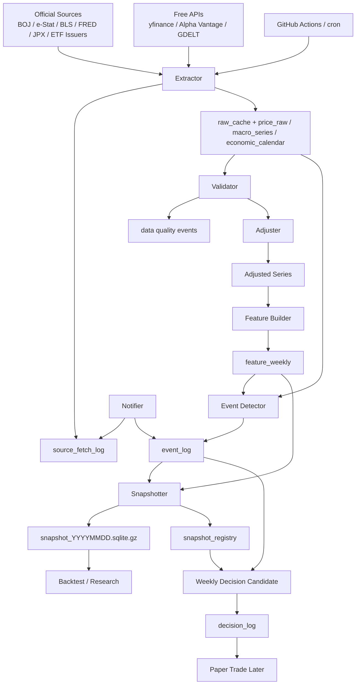

# RenCrow 株式・ETF 学習基盤 実装仕様書

## 0. 位置づけ

この仕様書は、RenCrow / picoclaw_multiLLM に株式・ETF向けの AI トレーディング学習基盤を追加するための実装仕様である。source of truth は `docs/株式/株式_学習基盤.md` と `docs/株式/株式_アルゴリズム評価.md`、および株式プロンプト群のうち戦略、バックテスト、リスク、データ、ライブ基盤、コンプライアンス関連文書である。

今回作るものは売買AIではない。目的は、学習、検証、スナップショット、監査、将来の紙運用に耐えるデータ基盤を作ることである。高度な機械学習、ライブ発注、マーケットメイキング、統計的アービトラージの本番実装は対象外とする。

## 1. 全体方針

### 1.1 なぜ最初に学習基盤を作るか

RenCrow の前提は、個人運用、初期資金約100万円、週次売買、高流動性ETF中心、NISA長期投信との完全分離である。この条件では、最初に最適化すべき対象は「高収益モデル」ではなく、データの正確性、再現性、停止可能性、監査可能性である。

理由は次の通り。

- 週次売買では、ティックや高頻度データよりも、日次・週次データの調整、欠損検知、イベント回避の方が事故防止に効く。
- 小口資金では、複雑な執行アルゴや高回転戦略より、手数料、スプレッド、税、データ欠損の影響が大きい。
- 未整備の状態で ML や多数戦略を投入すると、アルファより過剰適合、先読み、運用事故のリスクが大きくなる。
- NISA と課税口座を混在させると、税務・評価・リスク管理が破綻しやすい。
- 後から同じ週次判断を再現できなければ、バックテスト、紙運用、本番移行の妥当性を確認できない。

### 1.2 学習基盤の責務

学習基盤は次を責務とする。

- ETF、株価、出来高、配当、分割、為替、金利、マクロ、経済イベント、ETF holdings を取得する。
- 取得ごとに `source_fetch_log` を残し、`success`、`partial`、`fail` を区別する。
- raw データを破壊せず保存する。
- raw と corporate action から adjusted 系列を再計算できるようにする。
- 週次特徴量を固定し、学習・バックテスト・紙運用の入力を明確にする。
- 毎週の snapshot をハッシュ付きで固定する。
- データ異常、イベント、NISA混在、ログ保存失敗を検知し、売買候補を停止できる状態にする。
- 将来の paper trade と small live trade の判断根拠を監査可能にする。

### 1.3 研究系と実運用系の境界

研究系は、データ収集、検証、特徴量生成、スナップショット、バックテストを担当する。実運用系は、週次判定、停止判定、紙運用、小額執行前の人間承認を担当する。

MVPでは実運用系のうち、`decision_log`、`paper_trade_log`、`order_log`、`tax_lot_log` のスキーマだけを作る。実ブローカー接続と自動発注は実装しない。

### 1.4 今回やらないこと

- ライブ発注API接続
- 自動売買の有効化
- マーケットメイキング
- 統計的アービトラージの本番実装
- 複雑なニューラルネットや高次元ML
- 第三者向けシグナル配信
- NISA口座の売買判断
- 有料データ前提の設計

## 2. 推奨アーキテクチャ

### 2.1 レイヤ構造

データは `raw -> clean -> adjusted -> feature -> snapshot` の順で扱う。

| 層 | 役割 | 保存方針 |
|---|---|---|
| raw | 取得元から得た原データ | 原則として破壊しない。取得元、取得時刻、fetch_id を残す |
| clean | 型、タイムゾーン、営業日、欠損分類を揃えたデータ | raw から再生成可能にする |
| adjusted | 分割、配当、為替を反映した比較可能系列 | raw と corporate_action から再計算可能にする |
| feature | 週次学習特徴量 | week_end 単位で固定し、先読みを避ける |
| snapshot | その週に見えていたデータ一式 | ハッシュ付きで固定し、後から再演できるようにする |

### 2.2 コンポーネント責務

| コンポーネント | 責務 |
|---|---|
| Extractor | yfinance、Alpha Vantage、BOJ、FRED、e-Stat、BLS、ETF issuer、GDELT から取得する |
| Validator | 欠損、異常値、営業日不一致、API制限、stale を検査する |
| Adjuster | `adj_close / close`、配当、分割、為替換算を処理する |
| Feature Builder | 週次リターン、ボラ、ドローダウン、移動平均乖離、イベント特徴量を作る |
| Event Detector | 攻めのシグナルではなく、停止・縮小の安全装置としてイベントを記録する |
| Snapshotter | SQLite snapshot、DB hash、features hash、欠損率、イベント状態を固定する |
| Scheduler | GitHub Actions または cron で日次・週次処理を起動する |
| Notifier | fail、partial、stop イベントを Slack webhook またはメールで通知する |
| Audit Logger | fetch、feature、decision、paper trade、order、tax lot の痕跡を保存する |

### 2.3 構成図



### 2.4 MVP構成

MVP はローカルPCまたは常時稼働PC上の SQLite を正本にする。GitHub にはコードと設定だけを置く。Google Drive などへ DB と snapshot をバックアップする。

### 2.5 将来拡張

SQLite は捨てない。外部閲覧やダッシュボードが必要になった場合だけ、`feature_weekly`、`snapshot_registry`、`event_log`、`decision_log` の参照用サブセットを Neon、Supabase、PostgreSQL へ複製する。正本は引き続き SQLite と snapshot archive とする。

## 3. データソース仕様

| 用途 | MVP推奨ソース | 取得方法 | 無料性 | 信頼度 | 注意点 |
|---|---|---|---|---|---|
| ETF・株価・出来高・配当・分割 | yfinance | `yfinance.download(auto_adjust=False, actions=True)` | 無料 | 中 | 非公式。研究・個人利用前提。本番前は別ソース検算 |
| 上場状態・補完価格 | Alpha Vantage | REST API | 無料枠あり | 中 | 回数制限あり。API key は secrets 管理 |
| 為替 | BOJ 外国為替市況、時系列検索 | HTML/CSV/API系取得 | 無料 | 高 | USDJPY は日本居住の円評価の基準 |
| 米国金利・マクロ | FRED / ALFRED | REST API | 無料 | 高 | ALFRED vintage を使える系列は改定履歴を保存 |
| 日本マクロ | e-Stat / BOJ | REST API / HTML | 無料 | 高 | e-Stat は appId 必須。release_date を残す |
| 経済イベント | BOJ、BLS、FOMC、e-Stat 公表予定 | HTML/API/手動補正 | 無料 | 高 | 主要イベントは攻めではなく veto に使う |
| JPX営業日・祝日 | JPXカレンダー | HTML/CSV化 | 無料 | 高 | 欠損が休場か取得失敗かを分ける |
| ETF holdings | NEXT FUNDS、BlackRock等 issuer 公開CSV/Excel | CSV/Excel download | 無料 | 中-高 | 更新遅れあり。指数構成予告は追わない |
| ニュース見出し | GDELT + 公式発表ページ | HTTP API / HTML | 無料 | 中 | 本文保存はしない。見出しと要約だけ |

データライセンス方針は、自己研究用に閉じる。無料データ、JPX/QUICK系情報、日経指数、issuer holdings、ニュース本文を第三者へ再配布しない。RenCrow から外部へシグナル配信しない。

## 4. ディレクトリ構成

MVPは repo 直下の独立ディレクトリとして置く。

```text
rencrow-data/
  README.md
  requirements.txt
  data/
    rencrow.db
    snapshots/
    raw_cache/
    archives/
  src/
    01_init_db.py
    02_fetch_market.py
    03_fetch_macro.py
    04_build_features.py
    05_detect_events.py
    06_make_snapshot.py
    lib/
      db.py
      hashing.py
      calendars.py
      quality.py
  config/
    instruments.yml
    calendars.yml
    sources.yml
    risk_limits.yml
  logs/
  tests/
    test_init_db.py
    test_fetch_market.py
    test_fetch_macro.py
    test_features.py
    test_events.py
    test_snapshot.py
```

GitHub Actions は repo 既定に合わせて `.github/workflows/` に置く。

```text
.github/workflows/
  rencrow_data_daily_ingest.yml
  rencrow_data_weekly_snapshot.yml
```

`rencrow-data/data/`, `rencrow-data/logs/`, `.env`, backup archive は git 管理しない。`config/*.yml` は API key を含めず git 管理する。

## 5. DBスキーマ

SQLite を正本にする。全テーブルは `created_at`、重要な派生テーブルは `source_fetch_id` または `snapshot_id` を持つ。日時は UTC ISO-8601 を基本にし、取引日・営業日は市場ローカル日付を `YYYY-MM-DD` で保存する。

### 5.1 `instruments`

目的: ETF、指数、FX、金利、マクロ系列、疑似現金資産を一意に管理する。

| カラム | 型 | 意味 |
|---|---|---|
| instrument_id | INTEGER PK | 内部ID |
| symbol | TEXT NOT NULL | `1306.T`, `SPY`, `USDJPY_BOJ` など |
| name | TEXT | 表示名 |
| asset_type | TEXT | `ETF`, `STOCK`, `INDEX`, `FX`, `RATE`, `MACRO`, `CASH_PROXY` |
| venue | TEXT | `TSE`, `NYSE`, `BOJ`, `FRED`, `ESTAT` |
| currency | TEXT | `JPY`, `USD` |
| timezone | TEXT | `Asia/Tokyo`, `America/New_York`, `UTC` |
| active | INTEGER | 1=有効、0=上場廃止・利用停止 |
| first_date | TEXT | 利用開始日 |
| last_date | TEXT | 利用終了日 |
| created_at | TEXT | 作成時刻 |
| updated_at | TEXT | 更新時刻 |

主キー: `instrument_id`。ユニーク: `(symbol, venue, first_date)`。インデックス: `symbol`, `asset_type`, `active`。

監査: シンボル再利用に備え、同一 `symbol` でも別 instrument として登録できる余地を残す。

### 5.2 `source_fetch_log`

目的: データ取得の全履歴を保存する。

| カラム | 型 | 意味 |
|---|---|---|
| fetch_id | INTEGER PK | 取得ID |
| source_name | TEXT | `yfinance`, `alpha_vantage`, `boj`, `fred`, `estat`, `gdelt` |
| endpoint | TEXT | URLまたは論理エンドポイント |
| requested_at | TEXT | 開始時刻 |
| finished_at | TEXT | 終了時刻 |
| status | TEXT | `running`, `success`, `partial`, `fail` |
| http_status | INTEGER | HTTP status |
| rows_fetched | INTEGER | 取得行数 |
| checksum | TEXT | raw payload hash |
| retry_count | INTEGER | 再試行回数 |
| error_message | TEXT | エラー要約 |
| raw_cache_path | TEXT | 保存したrawファイル相対パス |

インデックス: `(source_name, requested_at)`, `status`, `finished_at`。

監査: `fail` または `partial` は削除しない。週次 snapshot 前に未解決の `fail` / `partial` があれば停止候補にする。

### 5.3 `price_raw`

目的: 価格・出来高・調整済み終値を raw として保存する。

| カラム | 型 | 意味 |
|---|---|---|
| instrument_id | INTEGER | 対象 |
| trade_date | TEXT | 市場ローカル取引日 |
| open | REAL | 始値 |
| high | REAL | 高値 |
| low | REAL | 安値 |
| close | REAL | 終値 |
| adj_close | REAL | 取得元の調整済み終値 |
| volume | REAL | 出来高 |
| source_name | TEXT | 取得元 |
| fetch_id | INTEGER | 取得ID |
| created_at | TEXT | 挿入時刻 |

主キー: `(instrument_id, trade_date, source_name)`。インデックス: `(trade_date)`, `(fetch_id)`。

監査: 同一 source の同一日を再取得した場合は、値が変わったら `event_log` に `price_revision` を残す。raw の破壊的上書きは禁止し、MVPでは `INSERT OR REPLACE` ではなく差分検知後に更新する。

### 5.4 `corporate_action`

目的: 配当、分割、併合、上場廃止、合併などを保存する。

| カラム | 型 | 意味 |
|---|---|---|
| instrument_id | INTEGER | 対象 |
| action_date | TEXT | 発生日 |
| action_type | TEXT | `dividend`, `split`, `merge`, `delist`, `symbol_change` |
| value | REAL | 配当額、分割比率など |
| currency | TEXT | 配当通貨 |
| source_name | TEXT | 取得元 |
| fetch_id | INTEGER | 取得ID |
| context_json | TEXT | 補足 |

主キー: `(instrument_id, action_date, action_type, source_name)`。

監査: corporate action 変更は過去 feature に影響するため、次回 feature build と snapshot で差分を記録する。

### 5.5 `macro_series`

目的: 金利、CPI、雇用、為替、その他マクロ系列を保存する。

| カラム | 型 | 意味 |
|---|---|---|
| series_code | TEXT | `DGS10`, `USDJPY_BOJ`, `JP_CPI` |
| obs_date | TEXT | 観測日 |
| value | REAL | 値 |
| vintage_date | TEXT | ALFRED等の版日付 |
| release_date | TEXT | 公表日 |
| source_name | TEXT | 取得元 |
| fetch_id | INTEGER | 取得ID |
| unit | TEXT | 単位 |

主キー: `(series_code, obs_date, COALESCE(vintage_date,''), source_name)`。インデックス: `(series_code, obs_date)`, `(release_date)`。

監査: 公表前の値を使わない。feature build は `release_date <= week_end` を必須条件にする。

### 5.6 `economic_calendar`

目的: BOJ、FOMC、CPI、雇用統計、e-Stat重要統計の予定を保存する。

| カラム | 型 | 意味 |
|---|---|---|
| event_id | INTEGER PK | イベントID |
| event_date | TEXT | イベント日 |
| event_time_utc | TEXT | 可能なら発表時刻 |
| country | TEXT | `JP`, `US` |
| category | TEXT | `BOJ`, `FOMC`, `CPI`, `EMPLOYMENT`, `ESTAT` |
| event_name | TEXT | イベント名 |
| source_name | TEXT | 取得元 |
| importance | TEXT | `low`, `med`, `high`, `critical` |
| last_checked_at | TEXT | 最終確認 |
| context_json | TEXT | 補足 |

インデックス: `(event_date)`, `(category, importance)`。

監査: 予定変更を検知した場合は旧予定を消さず、`event_log` に `calendar_revision` を残す。

### 5.7 `etf_holding_snapshot`

目的: ETF holdings の月次または取得時点の構成を保存する。

| カラム | 型 | 意味 |
|---|---|---|
| instrument_id | INTEGER | ETF |
| snapshot_date | TEXT | holdings基準日 |
| constituent_code | TEXT | 構成銘柄コード |
| constituent_name | TEXT | 銘柄名 |
| weight | REAL | 比率 |
| quantity | REAL | 数量 |
| sector | TEXT | セクター |
| source_name | TEXT | issuer |
| fetch_id | INTEGER | 取得ID |

主キー: `(instrument_id, snapshot_date, constituent_code, source_name)`。

監査: holdings が40日超更新されない場合は `warn`、主要ETFなら `stop` 候補。

### 5.8 `feature_weekly`

目的: 学習とバックテストに使う週次特徴量を固定する。

| カラム | 型 | 意味 |
|---|---|---|
| instrument_id | INTEGER | 対象 |
| week_end | TEXT | 週末基準日 |
| close_adj_jpy | REAL | 円換算調整済み終値 |
| ret_1w | REAL | 1週リターン |
| ret_4w | REAL | 4週リターン |
| ret_12w | REAL | 12週リターン |
| vol_12w | REAL | 12週年率ボラ |
| drawdown_26w | REAL | 26週最大DD |
| ma_4w_gap | REAL | 4週MA乖離 |
| ma_12w_gap | REAL | 12週MA乖離 |
| volume_change_4w | REAL | 4週出来高変化率 |
| fx_ret_1w | REAL | USDJPY 1週変化 |
| us10y_change_1w | REAL | 米10年金利1週変化 |
| boj_flag | INTEGER | BOJ前後 |
| cpi_flag | INTEGER | CPI前後 |
| fomc_flag | INTEGER | FOMC前後 |
| employment_flag | INTEGER | 雇用統計前後 |
| holdings_turnover | REAL | ETF holdings 入替率 |
| event_risk_score | REAL | 0.0-1.0 |
| source_snapshot_id | INTEGER | 参照snapshot |
| created_at | TEXT | 作成時刻 |

主キー: `(instrument_id, week_end)`。インデックス: `(week_end)`, `(event_risk_score)`。

監査: feature は週次で固定する。再計算で値が変わった場合は snapshot hash も変わるため、理由を `snapshot_registry.notes` に残す。

### 5.9 `event_log`

目的: market、macro、etf、system、compliance のイベントを保存する。

| カラム | 型 | 意味 |
|---|---|---|
| event_id | INTEGER PK | イベントID |
| event_ts | TEXT | 発生時刻 |
| scope | TEXT | `market`, `macro`, `etf`, `system`, `compliance` |
| level | TEXT | `info`, `warn`, `stop` |
| reason | TEXT | 理由コード |
| value | REAL | 数値 |
| event_risk_score | REAL | 0.0-1.0 |
| context_json | TEXT | 根拠 |
| resolved_at | TEXT | 復帰時刻 |
| resolution_note | TEXT | 復帰理由 |

インデックス: `(event_ts)`, `(level)`, `(reason)`, `(resolved_at)`。

監査: `stop` は人間確認なしに resolved にしない。

### 5.10 `snapshot_registry`

目的: 毎週の再現可能なデータ状態を登録する。

| カラム | 型 | 意味 |
|---|---|---|
| snapshot_id | INTEGER PK | snapshot ID |
| snapshot_date | TEXT UNIQUE | 基準日 |
| snapshot_path | TEXT | `snapshot_YYYYMMDD.sqlite.gz` |
| db_hash | TEXT | DB全体または対象テーブルhash |
| features_hash | TEXT | feature_weekly hash |
| source_summary_json | TEXT | 使用ソース一覧 |
| data_start_date | TEXT | データ開始 |
| data_end_date | TEXT | データ終了 |
| missing_rate | REAL | 欠損率 |
| event_state_json | TEXT | イベント状態 |
| status | TEXT | `success`, `blocked`, `fail` |
| notes | TEXT | 補足 |
| created_at | TEXT | 作成時刻 |

インデックス: `(snapshot_date)`, `(status)`。

監査: `status != success` の snapshot は紙運用判断に使わない。

### 5.11 `decision_log`

目的: 週次判断候補の根拠を保存する。MVPでは発注しない。

| カラム | 型 | 意味 |
|---|---|---|
| decision_id | INTEGER PK | 判断ID |
| snapshot_id | INTEGER | 使用snapshot |
| decision_date | TEXT | 判断日 |
| account_scope | TEXT | `taxable`, `nisa`, `paper` |
| strategy_name | TEXT | 戦略名 |
| candidate_json | TEXT | 候補ウェイト |
| veto_json | TEXT | 停止理由 |
| approved | INTEGER | 人間承認 |
| approver | TEXT | 承認者 |
| approved_at | TEXT | 承認時刻 |
| created_at | TEXT | 作成時刻 |

インデックス: `(decision_date)`, `(snapshot_id)`, `(account_scope)`。

監査: `account_scope='nisa'` は原則禁止。NISA混在検知に使う。

### 5.12 `paper_trade_log`

目的: 紙運用の仮想注文・仮想約定を保存する。

| カラム | 型 | 意味 |
|---|---|---|
| paper_trade_id | INTEGER PK | 紙運用ID |
| decision_id | INTEGER | 元判断 |
| instrument_id | INTEGER | 対象 |
| side | TEXT | `buy`, `sell` |
| quantity | REAL | 数量 |
| decision_price | REAL | 判断価格 |
| simulated_fill_price | REAL | 仮想約定価格 |
| cost_bps | REAL | 仮定コスト |
| status | TEXT | `submitted`, `filled`, `cancelled`, `rejected` |
| created_at | TEXT | 作成時刻 |

監査: 実発注と混同しないよう `paper` を明示する。

### 5.13 `order_log`

目的: 将来の小額実運用に備えた実注文ログ。MVPでは未使用。

| カラム | 型 | 意味 |
|---|---|---|
| order_id | INTEGER PK | 内部注文ID |
| decision_id | INTEGER | 元判断 |
| broker_order_id | TEXT | ブローカー注文ID |
| instrument_id | INTEGER | 対象 |
| side | TEXT | 売買 |
| order_type | TEXT | `limit`, `market` |
| quantity | REAL | 数量 |
| limit_price | REAL | 指値 |
| status | TEXT | 状態 |
| submitted_at | TEXT | 送信時刻 |
| filled_at | TEXT | 約定時刻 |
| fill_price | REAL | 約定価格 |
| error_message | TEXT | エラー |

監査: 人間承認、キルスイッチ、リコンシリエーションと紐づける。MVPではテーブルのみ。

### 5.14 `tax_lot_log`

目的: 税務ロット、課税口座の取得単価、売却損益の根拠を保存する。

| カラム | 型 | 意味 |
|---|---|---|
| tax_lot_id | INTEGER PK | ロットID |
| account_scope | TEXT | `taxable` のみ |
| instrument_id | INTEGER | 対象 |
| acquired_date | TEXT | 取得日 |
| quantity | REAL | 数量 |
| acquisition_price | REAL | 取得単価 |
| disposed_date | TEXT | 売却日 |
| disposal_price | REAL | 売却単価 |
| realized_pnl | REAL | 実現損益 |
| source_order_id | INTEGER | 注文ID |
| created_at | TEXT | 作成時刻 |

監査: NISAは損益通算不可のため混在禁止。税務判断は最終的に証券会社・税理士・公式帳票を優先する。

## 6. 各スクリプト仕様

### 6.1 `01_init_db.py`

入力: `config/*.yml`、DB path。出力: `rencrow-data/data/rencrow.db`。

処理:

1. DBディレクトリを作成する。
2. SQLite `PRAGMA journal_mode=WAL`、`PRAGMA foreign_keys=ON` を設定する。
3. 全テーブルとインデックスを作成する。
4. `instruments.yml` から初期ETF、FX、金利、マクロ系列を upsert する。
5. schema version を `event_log` または将来の `schema_migrations` に記録する。

エラー処理: schema 作成失敗は即 `fail`。既存DBは破壊しない。

ログ: 初期化対象DB、作成テーブル数、upsert件数。

テスト: DB初期化、冪等性、必須インデックス、初期 instrument 登録。

### 6.2 `02_fetch_market.py`

入力: `config/instruments.yml`。出力: `price_raw`, `corporate_action`, `source_fetch_log`, `raw_cache`。

処理:

1. 対象ETF・株式を列挙する。
2. source ごとに `source_fetch_log` を `running` で開始する。
3. yfinance は `auto_adjust=False`, `actions=True` で取得する。
4. raw payload を `raw_cache/source/YYYYMMDD/` に保存し checksum を計算する。
5. `price_raw` と `corporate_action` に保存する。
6. 既存値との差分があれば `event_log` に `price_revision` または `corporate_action_revision` を残す。
7. 必須銘柄の一部失敗は `partial`、全失敗は `fail`、全成功は `success`。

エラー処理: API制限、空データ、必須カラム欠落を区別する。再試行は 60秒、180秒、600秒。

ログ: symbol、rows、date range、status、error。

テスト: 成功、空データ、partial、カラム欠落、差分検知。

### 6.3 `03_fetch_macro.py`

入力: `config/calendars.yml`, `config/sources.yml`。出力: `macro_series`, `economic_calendar`, `source_fetch_log`。

処理:

1. BOJ 為替、FRED/ALFRED、e-Stat、BLS/FOMC/BOJイベントを取得する。
2. release_date と vintage_date が取得できる場合は必ず保存する。
3. 経済イベントは `importance` を付与する。
4. 予定変更を検知したら `event_log` に `calendar_revision` を残す。
5. 主要イベントソースの取得失敗は `warn` ではなく停止候補にする。

エラー処理: API key 不足、HTTP失敗、schema変更、rate limit を分ける。

ログ: series_code、event category、rows、status。

テスト: macro fetch 成功/失敗/partial、release_date 制約、イベント重複排除。

### 6.4 `04_build_features.py`

入力: `price_raw`, `corporate_action`, `macro_series`, `economic_calendar`, `etf_holding_snapshot`。出力: `feature_weekly`。

処理:

1. raw 価格から `adj_factor = adj_close / close` を作る。
2. 調整済み OHLC と円換算価格を作る。
3. JPX/NYSE営業日カレンダーで欠損を分類する。
4. 週末基準日に resample する。
5. feature を計算する。
6. `release_date <= week_end` と `week_end` 以前の価格だけを使う。
7. 既存 week の feature を更新する場合は差分を `event_log` に記録する。

エラー処理: 必須価格バー欠損、為替欠損、調整係数異常、feature 欠損率過大で `fail`。

ログ: week_end、instrument数、欠損率、feature件数。

テスト: feature 計算、先読み防止、欠損分類、調整係数異常。

### 6.5 `05_detect_events.py`

入力: `feature_weekly`, `price_raw`, `economic_calendar`, `source_fetch_log`, `etf_holding_snapshot`。出力: `event_log`, `feature_weekly.event_risk_score`。

処理:

1. 主要予定イベントの前後2営業日を検知する。
2. 日次リターン z-score、5日ボラ、出来高スパイクを検知する。
3. ETF holdings 入替率と上位構成比の変化を検知する。
4. `source_fetch_log` の `fail` / `partial` / stale を検知する。
5. `info`、`warn`、`stop` と `event_risk_score` を付与する。
6. 復帰条件を `context_json` に保存する。

エラー処理: 必須イベントソース欠落は `stop`。ニュース取得失敗は原則 `warn`。

ログ: event件数、stop件数、risk score max。

テスト: BOJ/FOMC/CPI/雇用統計、価格スパイク、出来高スパイク、API異常、復帰条件。

### 6.6 `06_make_snapshot.py`

入力: DB全体、`feature_weekly`, `event_log`, `source_fetch_log`。出力: `snapshot_YYYYMMDD.sqlite.gz`, `snapshot_registry`。

処理:

1. snapshot 前チェックを実行する。
2. 未解決 `stop`、必須 `fail` / `partial`、欠損率過大があれば `blocked` snapshot を記録し、判断用途には使わない。
3. SQLite の一貫コピーを作る。
4. gzip 圧縮して `data/snapshots/snapshot_YYYYMMDD.sqlite.gz` に保存する。
5. `db_hash` と `features_hash` を計算する。
6. 使用ソース、データ期間、欠損率、イベント状態を `snapshot_registry` に保存する。

エラー処理: hash不一致、圧縮失敗、書き込み失敗は `fail`。snapshot 失敗時は紙運用判断停止。

ログ: snapshot path、hash、status、missing_rate。

テスト: hash 再現、blocked snapshot、gzip 展開、registry 整合性。

## 7. データ調整仕様

### 7.1 分割調整

分割は `corporate_action.action_type='split'` に保存する。MVPでは yfinance の `adj_close` を基準に `adj_factor` を使う。将来、分割比率を自前で再構成する場合も raw は保持する。

### 7.2 配当調整

配当は `corporate_action.action_type='dividend'` に保存する。価格比較用の調整済み価格は `adj_close` を基準にする。total return 系列が必要な場合は、分割補正済み終値 `P_t` と配当 `D_t` を使い、`TR_t = TR_{t-1} * (P_t + D_t) / P_{t-1}` で別系列として生成する。

### 7.3 adjustment factor

`close` が非ゼロかつ `adj_close` が存在する場合、`adj_factor = adj_close / close` とする。調整済み OHLC は `open_adj = open * adj_factor`、`high_adj = high * adj_factor`、`low_adj = low * adj_factor`、`close_adj = close * adj_factor`。

`adj_factor` が前営業日比で極端に変化し、該当日に corporate action がない場合は `adjusted_factor_anomaly` として `event_log.level='stop'` にする。

### 7.4 欠損分類

| 分類 | 条件 | 扱い |
|---|---|---|
| 休場 | 公式営業日カレンダー上休場 | 正常欠損 |
| 取得失敗 | 営業日なのに必須バーがない | `stop` 候補 |
| 上場廃止 | listing status が delisted | `active=0`、履歴保持 |
| API制限 | rate limit / quota | `partial` または `fail` |
| 遅延更新 | issuer holdings 等の更新遅れ | 40日超で `warn`、主要ETFは `stop` 候補 |

### 7.5 為替換算

米国ETFなど USD 建て資産を円評価する場合は、BOJ USDJPY 日次系列を使って `close_adj_jpy = close_adj_usd * USDJPY` とする。週次特徴量は円換算後の系列を優先する。

### 7.6 ETF holdings 差分

同一ETFの直近2 snapshot を比較し、構成銘柄集合の対称差分率、上位10銘柄入替率、セクター比率変化を計算する。MVPの `holdings_turnover` は `changed_constituents / union_constituents` とする。

### 7.7 シンボル再利用・上場廃止

同じ symbol が再利用された可能性がある場合、既存 instrument を上書きしない。`last_date` を閉じ、新しい `instrument_id` を作る。

## 8. Feature Store仕様

すべての feature は `week_end` 時点で利用可能だった情報だけを使う。売買判断で使う場合は、原則として1週ラグをかける。

| 特徴量 | 計算式 | 必要データ | 欠損時 | 先読み防止 | 保存 |
|---|---|---|---|---|---|
| `ret_1w` | `P_w / P_{w-1} - 1` | 調整済み円価格 | 欠損 | week_end 以前のみ | 毎週 |
| `ret_4w` | `P_w / P_{w-4} - 1` | 同上 | 欠損 | 同上 | 毎週 |
| `ret_12w` | `P_w / P_{w-12} - 1` | 同上 | 欠損 | 同上 | 毎週 |
| `vol_12w` | 日次リターン60営業日std * sqrt(252) | 調整済み日次価格 | 60本未満は欠損 | 同上 | 毎週 |
| `drawdown_26w` | `P_w / max(P_{w-25:w}) - 1` | 週次価格 | 期間不足は min_periods あり | 同上 | 毎週 |
| `ma_4w_gap` | `P_w / MA4 - 1` | 週次価格 | 4週未満欠損 | 同上 | 毎週 |
| `ma_12w_gap` | `P_w / MA12 - 1` | 週次価格 | 12週未満欠損 | 同上 | 毎週 |
| `volume_change_4w` | `Vol_w / mean(Vol_{w-4:w-1}) - 1` | 出来高 | 期間不足欠損 | 当週確定後のみ | 毎週 |
| `fx_ret_1w` | `USDJPY_w / USDJPY_{w-1} - 1` | BOJ FX | 欠損なら feature 欠損 | release_date確認 | 毎週 |
| `us10y_change_1w` | `DGS10_w - DGS10_{w-1}` | FRED/ALFRED | 欠損 | vintage/release確認 | 毎週 |
| `boj_flag` | BOJ前後2営業日なら1 | economic_calendar | calendar欠損は stop | event_date基準 | 毎週 |
| `cpi_flag` | CPI前後2営業日なら1 | economic_calendar | 同上 | 同上 | 毎週 |
| `fomc_flag` | FOMC前後2営業日なら1 | economic_calendar | 同上 | 同上 | 毎週 |
| `employment_flag` | 雇用統計前後2営業日なら1 | economic_calendar | 同上 | 同上 | 毎週 |
| `holdings_turnover` | holdings 対称差分率 | holdings snapshot | 古ければ warn/stop | snapshot_date <= week_end | 月次反映 |
| `event_risk_score` | event detector の最大/加重スコア | event_log | event取得失敗は stop | week_end 以前のみ | 毎週 |

## 9. Event Detector仕様

イベント検知は、利益を狙う攻めのシグナルではなく、通常運転を止める安全装置である。

### 9.1 対象イベント

| イベント | 検知 | level | score | 復帰条件 |
|---|---|---|---:|---|
| BOJ会合 | 前後2営業日 | `warn` または `stop` | 0.6-1.0 | 発表翌営業日以降、人間確認 |
| FOMC | 前後2営業日 | `warn` または `stop` | 0.6-1.0 | 同上 |
| CPI | 前後2営業日 | `warn` | 0.5-0.8 | 発表後バー確認 |
| 雇用統計 | 前後2営業日 | `warn` | 0.5-0.8 | 発表後バー確認 |
| e-Stat重要統計 | 前後2営業日 | `info`/`warn` | 0.3-0.6 | 発表後確認 |
| 大幅価格変動 | 日次リターンz-score >= 2.5、絶対値5%以上 | `warn`/`stop` | 0.6-1.0 | 価格安定と人間確認 |
| 出来高スパイク | 63営業日平均の2倍超 | `info`/`warn` | 0.3-0.7 | 翌営業日確認 |
| holdings 大幅変化 | 入替率20%超または上位10銘柄大幅変化 | `warn` | 0.5-0.8 | holdings確認 |
| API / データ異常 | required source fail/partial/stale | `stop` | 1.0 | 再取得成功、snapshot再作成 |

### 9.2 出力

`event_log` に `scope`, `level`, `reason`, `event_risk_score`, `context_json`, `resolved_at`, `resolution_note` を保存する。`context_json` には入力値、閾値、対象日、対象 instrument、復帰条件を含める。

## 10. スナップショット仕様

snapshot は毎週の研究、バックテスト、紙運用判断を再現するための正本である。

### 10.1 ファイル

ファイル名は `rencrow-data/data/snapshots/snapshot_YYYYMMDD.sqlite.gz` とする。`YYYYMMDD` は JST の snapshot 基準日。

### 10.2 hash

- `db_hash`: 対象テーブルを安定順序で dump した SHA-256。
- `features_hash`: `feature_weekly` を `(week_end, instrument_id)` 順にCSV化した SHA-256。
- raw payload hash は `source_fetch_log.checksum` に保持する。

### 10.3 registry項目

`snapshot_registry` には DBハッシュ、features_hash、使用データ期間、使用ソース一覧、欠損率、イベント状態、status、再現手順メモを保存する。

### 10.4 作成前停止条件

次のいずれかがあれば `status='blocked'` とし、紙運用判断に使わない。

- required source stale > 48h
- required price bar 欠損
- adjusted factor 異常変化
- `event_risk_score >= 0.9`
- 主要イベント前後で人間確認未済
- holdings snapshot が40日超
- DB migration 後の再検証未完了
- source_fetch_log に未解決 `fail` / `partial`
- NISA資産と課税口座資産が混在
- 税務・注文ログ保存失敗

## 11. スケジューリング仕様

GitHub Actions または cron を使う。GitHub Actions の cron は UTC で書く。

| ジョブ | JST | UTC目安 | 処理 |
|---|---:|---:|---|
| market ingest | 平日 17:30 | 08:30 | `02_fetch_market.py` |
| macro ingest | 平日 19:00 | 10:00 | `03_fetch_macro.py` |
| feature build | 土曜 08:00 | 金曜 23:00 | `04_build_features.py` |
| event detect | 土曜 08:15 | 金曜 23:15 | `05_detect_events.py` |
| snapshot build | 土曜 08:30 | 金曜 23:30 | `06_make_snapshot.py` |
| event override | 手動 | 手動 | 主要イベント時の再実行 |

Secrets は GitHub Actions Secrets に置く。ローカル実行では `.env` を使う。失敗通知は Slack webhook または GitHub Actions の失敗通知を使う。

## 12. 監査ログ・停止条件

### 12.1 毎週チェックリスト

- 必須ETF・為替・金利の最新バーが揃っている。
- 直近の `source_fetch_log` に未解決の `fail` / `partial` がない。
- 前回週の snapshot が `success` で固定済み。
- BOJ / CPI / 雇用 / FOMC の前後2営業日か確認済み。
- ETF holdings が40日以内。
- 週次 feature 欠損率が閾値以下。
- 価格と adjustment factor に異常跳ねがない。
- API key 期限切れや webhook エラーがない。
- NISA資産を参照していない。
- 税務用ログと注文ログの保存先が正常。

### 12.2 停止条件

停止条件は snapshot 作成、decision 作成、paper trade 作成の前段で共通に使う。`stop` 発生時は人間確認を必須とする。

## 13. セキュリティ・バックアップ仕様

### 13.1 Secrets

API key、webhook URL、クラウド認証情報はコード、docs、config に書かない。GitHub Actions では Secrets、ローカルでは `.env` を使う。

### 13.2 `.gitignore`

最低限、次を git 管理しない。

```gitignore
rencrow-data/data/
rencrow-data/logs/
rencrow-data/.env
*.sqlite
*.db
*.sqlite.gz
*.zst
*.parquet
```

### 13.3 バックアップ

- 毎日: `rencrow.db.zst` を Google Drive 等へ上書き保存。
- 毎週: `snapshot_YYYYMMDD.sqlite.gz` を別名保存。
- 毎月: `feature_weekly.parquet`, `event_log.csv`, `decision_log.csv` を archive。
- 保存期間: 法定断定ではなく内部統制ポリシーとして7年保管を推奨。

### 13.4 public repo 可否

置いてよいもの: ソースコード、空のサンプルconfig、ドキュメント、テスト用ダミーデータ。

置いてはいけないもの: API key、webhook URL、実DB、snapshot、約定、税務ロット、口座情報、raw paid/licensed data。

## 14. 法規制・コンプライアンス注意

この節は法務・税務助言ではなく、個人運用上の安全側の設計方針である。

- 高頻度売買に近づかない。週次運用を前提にする。
- 自己資金・自己利用に限定する。
- 第三者への継続的助言、シグナル配信、他人資金運用をしない。
- NISA と課税口座を完全に分離する。
- 無料データやライセンス制限のあるデータを外部配布しない。
- 実運用前に最低8-12週間の紙運用を行う。
- 人間承認なしにライブ発注しない。
- 戦略変更、停止解除、主要イベント前後の判断はログに残す。

## 15. テスト仕様

| テスト | 観点 |
|---|---|
| DB初期化 | 全テーブル、インデックス、冪等性 |
| market fetch | 成功、失敗、partial、API制限、空データ |
| macro fetch | 成功、失敗、partial、release_date、vintage_date |
| corporate action | split、dividend、adj_factor、差分検知 |
| 欠損検知 | 休場、取得失敗、上場廃止、API制限 |
| feature_weekly | 計算式、欠損、先読み防止、週次固定 |
| event detector | BOJ/FOMC/CPI/雇用統計、価格スパイク、出来高スパイク、API異常 |
| snapshot hash | 同一入力で同一hash、差分でhash変化、gzip復元 |
| source_fetch_log | runningから完了、fail/partial保持、checksum |
| NISA混在防止 | `account_scope='nisa'` の拒否、課税口座限定 |
| Secrets漏洩防止 | `.env` と key パターンが git diff に出ない |
| リグレッション | 既存 snapshot の feature 再計算が意図せず変わらない |

## 16. 実装フェーズ分割

### Phase 0: 既存RenCrow構造確認、置き場所決定

`rencrow-data/` を repo 直下に作る。既存 Go runtime とは疎結合にし、まず Python + SQLite の独立基盤として始める。Viewer 連携は Phase 8 以降。

### Phase 1: SQLite schema と init_db

全テーブル、インデックス、初期 instruments、`.gitignore`、README、requirements を作る。テストは DB 初期化と冪等性。

### Phase 2: market ingest

yfinance と Alpha Vantage 補助で価格、出来高、配当、分割を取得し、raw_cache と DB に保存する。

### Phase 3: macro/calendar ingest

BOJ、FRED/ALFRED、e-Stat、BLS/FOMC/BOJ calendar を保存する。主要イベント取得失敗を停止候補にする。

### Phase 4: feature_weekly

調整済み円価格と初期特徴量を作る。先読み防止と欠損分類をテストする。

### Phase 5: event detector

予定イベント、価格スパイク、出来高スパイク、holdings変化、API異常を `event_log` に保存する。

### Phase 6: snapshot registry

週次 snapshot、hash、欠損率、使用ソース、イベント状態を固定する。

### Phase 7: GitHub Actions / cron

日次 ingest と週次 snapshot を自動化する。Secrets と失敗通知を設定する。

### Phase 8: audit dashboard / paper trade 前段

Viewer または簡易HTML/CLIで、source status、feature欠損、event、snapshot、decision候補を確認できるようにする。実発注はしない。

### Phase 9: 8-12週間の紙運用検証

同じ条件で paper trade を継続し、停止条件、イベントveto、feature安定性、ログ再現性を確認する。

### Phase 10: 小額実運用の前提条件整理

ブローカー、注文方式、人間承認、税務ログ、キルスイッチ、リコンシリエーションを別仕様として作る。ここまで到達するまでライブ発注は実装しない。

## 17. MVP完了条件

MVP完了は次を満たすこと。

- `01_init_db.py` から `06_make_snapshot.py` までがローカルで順に実行できる。
- 主要ETF、BOJ FX、FRED/ALFRED、主要経済イベントがDBに保存される。
- `feature_weekly` が週次で生成される。
- `event_log` に予定イベントとデータ異常が保存される。
- `snapshot_YYYYMMDD.sqlite.gz` と `snapshot_registry` が作られる。
- 未解決 `fail` / `partial` または `stop` イベントがある場合、snapshot が判断用途で blocked になる。
- テストが全て通る。
- DB、snapshot、logs、secrets が git に入らない。
