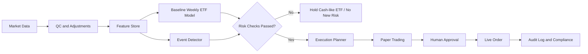

# RenCrow向けアルゴ実装優先度評価報告

## Executive Summary

結論からいうと、あなたが集めた「①〜⑯ Event Detector 含む」プロンプト群は、**学習用の発想としては非常に優秀**ですが、**そのまま RenCrow に一括投入してライブ売買させる設計は推奨しません**。理由は三つあります。第一に、週次売買・100万円・NISA分離という制約では、学術的に強い手法でも実務的に過剰なものが多いこと。第二に、バックテスト、データ調整、税・コスト・規制、監査ログが未整備の状態で高機能モジュールを増やすと、アルファよりオペレーショナルリスクの方が大きくなりやすいこと。第三に、公開研究で再現性が比較的高いプレミアムや実装手法の多くは、**年率数％〜十数％台の期待値を積み上げるもの**であり、「最短で100万円を200万円」に最適化すると、モデルがレバレッジ・集中・高回転へ歪みやすいことです。価値・モメンタム・サイズ・品質などの因子プレミアム、あるいは古典的ペアトレードや実装ショートフォール最小化の文献は強い土台を提供しますが、いずれも「安全に倍増を保証する理論」ではありません。 citeturn31search17turn36view2turn35view6turn10search0turn35view0

RenCrow で最優先にすべきは、**⑨データパイプライン、②バックテスト、③リスク管理、⑩執行、⑬紙運用を含むライブ基盤、⑮コンプライアンス、⑯イベント検知**です。これに、**①戦略設計**と**週次で実装しやすい⑥ファクター、⑧マクロ・レジーム、⑫最適化、⑭ファクターバックテスター**を加えるのが、現実的で安全なコアです。逆に、**⑤マーケットメイキング**は高頻度の指値・在庫管理・板データ前提であり、週次売買・小口資金・NISA分離とは最も相性が悪く、Research only もしくは除外に近い評価です。**⑦統計的アービトラージ**と**⑪機械学習アルファ**は、学術的には有効でも、短期データ品質・空売り・売買コスト・構造変化・過学習の影響を強く受けるため、初期導入の主役には向きません。 citeturn38view5turn33view1turn35view6turn35view7turn35view0turn36view8

あなたの条件では、**NISAの投信は長期の非課税コア資産として完全に別勘定**で管理し、RenCrow は**課税口座の「戦術オーバーレイ」**として運用するのが最も合理的です。金融庁は NISA を少額投資・長期資産形成の非課税制度として位置付けており、運用益は非課税です。一方、特定口座の上場株式等には原則として所得税等 15.315% と住民税 5% がかかります。したがって、税引後で100万円を200万円にしたいなら、損益通算等を無視した単純化計算でも、売却評価額は約225万円が必要です。つまり、RenCrow の目的関数は「最短倍増」ではなく、**最大ドローダウン制約下での複利成長**に置いた方が、学術的にも実務的にも整合的です。 citeturn33view2turn34view0


## 評価軸と設計原則

この評価では、各モジュールを「理論の強さ」だけでなく、**週次売買との適合性、RenCrow で直接売買できる商品への落とし込み、履歴データの確保しやすさ、先読みバイアス回避、コスト・税後での残存アルファ、規制・監査容易性**という六つの軸で見ています。バックテストは、データスヌーピングと過剰適合を防がなければ無意味です。White の Reality Check は、同一データ上で多数の仕様探索を行うと“たまたま良く見えるモデル”を選びやすいことを明示し、Bailey らはバックテスト過剰最適化がアウト・オブ・サンプル成績を大きく損なうことを論じています。さらに、Shumway は上場廃止リターンの欠落が小型株・ distress 銘柄の成績を大きく歪めうることを示しました。したがって、RenCrow 向けの「先進的手法」は、まず先進的なモデルではなく、**先進的な検証手続き**から始めるべきです。 citeturn36view8turn24search10turn37view7

実装商品は、現段階では**高流動性ETF中心**が最も適しています。Interactive Brokers は API 経由の自動売買、紙口座、グローバルな株式・ETF・先物・為替などへのアクセスを提供しており、日本法人サイトでも ETF 取引やグローバル商品アクセスを明示しています。100万円規模・週次売買であれば、機関投資家向けの複雑な子注文ルーティングよりも、**「売買対象を流動性の高いETFに限定する」ことが最大のコスト削減策**になります。イベント時だけ例外対応する設計にも、ETF は最も扱いやすい器です。 citeturn33view4turn33view5turn30search2turn30search7turn30search13

NISA は長期・非課税の資産形成口座であり、あなたがすでに投資信託を保有しているなら、**RenCrow は NISA と切り離し、課税口座の戦術レイヤーだけを見る**のが合理的です。もし将来、RenCrow を他人資金や第三者への助言に広げるなら、金融庁のガイドブックが示すように、投資運用業や投資助言・代理業の登録論点が生じます。自己資金のみを対象とするか、対外提供まで視野に入れるかで、ガバナンス設計は最初から分けておく必要があります。 citeturn33view2turn34view1turn34view2

RenCrow の安全設計は、次の一本に集約できます。**「週次ベースのベース戦略」＋「イベント検知による veto」＋「厳格なリスク制御」＋「紙運用からの段階導入」**です。FOMC、CPI、日銀会合のような予定イベントは公式カレンダーから取れ、学術研究でも株式リスクプレミアムがこうした発表日周辺に偏って実現することが示されています。ただし、その収益は恒常的な“簡単な抜け道”ではなく、時期やレジームで変化しうるため、イベントは「攻める材料」よりも「新規建て抑制・サイズ縮小」のトリガーとして用いる方が安全です。 citeturn34view3turn34view4turn34view5turn17search6turn16search13turn22search9



## モジュール別比較表

| モジュール | 主目的 | 週次適合 | 期待効果 | 主な限界 | RenCrow安全化 | 優先度 | 主要根拠 |
|---|---|---:|---|---|---|---|---|
| ① 戦略アーキテクト枠 | 実装可能な戦略仮説の設計 | 高 | ETF回転・因子・マクロを整理できる | 机上アイデアが過剰化しやすい | ETF限定、週次、長期OOS必須 | 必須 | citeturn12search0turn27search3turn35view2 |
| ② Two Sigma バックテスト | 検証の土台 | 高 | 先読み・過剰適合の抑制 | データ品質が悪いと無力 | WFO/CPCV、手数料・税後評価 | 必須 | citeturn36view8turn24search10turn37view7 |
| ③ Citadel リスク管理 | 破綻回避 | 高 | DD抑制、ボラ管理、サイズ制御 | リターン上限も削る | DD停止、ボラ目標、損失上限 | 必須 | citeturn34view6turn34view7 |
| ④ Renaissance アルファ研究 | 単純ルール以上の予測源発見 | 中 | 週次シグナルの改善余地 | データスヌーピングが最大敵 | 少数特徴量、単純仮説、RC必須 | 中 | citeturn36view8turn36view2turn37view0 |
| ⑤ Jane Street マーケットメイキング | 板でスプレッド収益 | 低 | 理論は強い | 高頻度・在庫・板・登録論点 | 学習専用、ライブ除外 | 低 | citeturn38view5turn33view1 |
| ⑥ AQR ファクターモデル | 長期プレミアム取り | 高 | バリュー/モメンタム/品質の再現性 | 長期停滞、 crowding、 timing困難 | L/SでなくETF・ロング偏重で | 高 | citeturn31search17turn36view2turn37view5turn37view6turn37view4 |
| ⑦ D.E. Shaw 統計アービトラージ | 平均回帰の市場中立 | 低〜中 | 歴史的には有効例あり | 空売り・借株・関係崩壊 | ETFペア研究まで、初期除外 | 低 | citeturn35view6turn35view7turn32search8turn26search0 |
| ⑧ Bridgewater マクロ戦略 | レジーム・イベント対応 | 高 | 週次の資産配分オーバーレイに好適 | 指標遅行・改定・過少サンプル | 主要イベントは veto 中心 | 高 | citeturn36view5turn36view6turn34view3turn34view4turn34view5 |
| ⑨ Bloomberg データ基盤 | 研究・本番の燃料 | 高 | 再現性、監査性、調整の自動化 | 初期構築コスト | 調整後価格、delist処理、API固定 | 必須 | citeturn25search5turn28search2turn28search15turn37view7 |
| ⑩ Virtu 執行アルゴ | コスト最小化 | 中〜高 | スリッページ抑制、TCA可能 | 小口では複雑化しすぎる | 小口は単純指値/成行ガード中心 | 高 | citeturn10search0turn10search11turn25search1turn25search7 |
| ⑪ Point72 MLアルファ | 非線形予測 | 中 | 豊富な特徴量で改善余地 | データ量・過学習・再学習負担 | ベース戦略確立後に限定研究 | 中 | citeturn35view0turn11search9turn36view8 |
| ⑫ Man Group 最適化 | 複数戦略の配分 | 高 | 分散・回転・制約管理 | 平均分散は推定誤差に弱い | HRP/ERC優先、MVOは補助 | 高 | citeturn12search0turn35view2turn37view3turn27search3 |
| ⑬ Millennium ライブ基盤 | 紙→本番運用 | 高 | 自動化、監視、キルスイッチ | 実装不備が事故化 | 紙口座先行、人承認、全ログ | 必須 | citeturn33view4turn33view5turn25search1turn34view7 |
| ⑭ Dimensional 因子バックテスター | 学術厳密な長期検証 | 高 | 因子の持続性と実装性を確認 | 無料データでは限界 | survivorship-freeを優先 | 高 | citeturn37view1turn20search9turn19search2turn37view7 |
| ⑮ Goldman コンプライアンス | 規制・税・監査 | 高 | 事故・違反の回避 | 地味で後回しにされやすい | NISA分離、自己資金限定、監査証跡 | 必須 | citeturn33view1turn33view3turn34view1turn34view2turn33view0turn34view0 |
| ⑯ Event Detector | 予定・非予定イベント検知 | 高 | 週次戦略の弱点を補完 | 利得化より回避効果が主 | FOMC/CPI/BOJ/雇用週を自動検知 | 必須 | citeturn34view3turn34view4turn34view5turn17search6turn16search7 |

## モジュール別評価ノート

**① 戦略アーキテクト枠。** これは「何をやるか」を定義する上流設計です。理論的には、Markowitz のポートフォリオ理論、Black-Litterman のビュー統合、López de Prado のHRPのように、戦略アイデアは最終的に資産配分と制約に落ちる必要があります。ただし Michaud が指摘した通り、最適化や高度な戦略設計は入力誤差を増幅しやすいので、RenCrow では「流動性の高いETF」「週次シグナル」「イベント veto」「最大DD制約」を最初から組み込んだ**狭い問題設定**にするべきです。**簡易版プロンプト**は「週次・ETF・コスト込み・イベント回避を前提に、複雑度最小で1戦略だけ提案せよ」。**拒否条件**は、空売り必須、日中高頻度、説明不能な特徴量依存、期待収益のみでDD未定義。**ログ**はユニバース、仮説、保有期間、制約、採用理由です。 citeturn12search0turn35view2turn27search3

**② Two Sigma バックテスト。** 学術的・実務的に最重要です。White の Reality Check は、多数ルールを試すと偶然当たるものが出るだけだと警告し、Bailey らはバックテスト過剰最適化の危険を示しました。Shumway の上場廃止バイアス研究は、データ処理が甘いと小型株戦略が過大評価されることを示しています。RenCrow では、**ウォークフォワード、エンバーゴ付き時系列CV、手数料・スプレッド・税後評価、分割・配当調整、上場廃止処理**が最低条件です。**簡易版プロンプト**は「週次終値ベースで、1週ラグ執行、売買コスト、税後評価、OOS中心で検証せよ」。**拒否条件**は、in-sampleしか良くない、検証窓が1レジームしかない、無料データの未調整価格を使用。**ログ**はデータ版、ルール版、訓練/検証期間、コスト仮定、OOS指標です。 citeturn36view8turn24search10turn37view7

**③ Citadel リスク管理。** 週次アルゴで一番「勝率」より重要なのが破綻回避です。バーゼルの市場リスク基準は市場価格変動による損失管理を前提とし、SEC Rule 15c3-5 は市場アクセスに先立つ有効なリスク管理コントロールを要求しています。RenCrow が自己資金運用でも、考え方は同じで、**最大ドローダウン、ボラ目標、1取引損失上限、銘柄数下限、イベント時のサイズ低下**を前段に置くべきです。**簡易版プロンプト**は「期待リターンより先に、最大DD・目標ボラ・ポジション上限を満たさない案は棄却せよ」。**拒否条件**は、集中度過大、イベント前のレバ増加、損失閾値なし。**ログ**は予想ボラ、想定DD、採用サイズ、停止理由です。 citeturn34view6turn34view7

**④ Renaissance アルファ研究。** アルファ探索自体は有用ですが、RenCrow 向けには複雑化を抑える必要があります。学術的に強いのは、中期モメンタムや価値のように複数市場で再現される特徴で、Gu・Kelly・Xiu も機械学習の利点を「高次元予測」へ置いていますが、同時に正則化とOOS重視を前提にしています。RenCrow では、まず**6〜26週モメンタム、ボラ調整トレンド、レジーム条件付き回転、イベント回避**のような単純特徴に限定するのが妥当です。**簡易版プロンプト**は「新特徴量は3個以下、既存ベース戦略に対する増分効果のみを検証せよ」。**拒否条件**は、特徴量50個以上、説明不能、OOS改善が取引コスト未満。**ログ**は特徴量一覧、重要度、追加ターンオーバー、純増Sharpeです。 citeturn35view0turn36view2turn36view8

**⑤ Jane Street マーケットメイキング。** 理論は優秀です。Avellaneda–Stoikov は、ディーラーが限度注文簿で在庫リスクと約定到着リスクを両立しながら bid/ask を最適化する問題を定式化しています。しかし、これは**高頻度・板データ・継続的な両建て・在庫管理**を前提にしており、日本でも高速取引行為には登録制度があります。したがって、週次売買・100万円・NISA分離という条件では、これは**研究教材**であって本番候補ではありません。**簡易版プロンプト**は「市場メイク実装ではなく、スプレッド・在庫・流動性理論の要約に限定せよ」。**拒否条件**は、ミリ秒発注、両建て連続クオート、板優位の仮定。**ログ**は無しでもよいが、学習記録と適用禁止理由は残すべきです。 citeturn38view5turn33view1

**⑥ AQR ファクターモデル。** 16モジュールの中で、RenCrow の中核候補です。Fama–French は市場・サイズ・価値の共通因子を示し、Asness・Moskowitz・Pedersen は価値とモメンタムが多市場・多資産で広く観察され、両者が互いに分散効果を持つことを示しました。AQR の後続整理でも、主要因子は理論・OOS・公開データによる検証が重要であるとされています。他方で、因子タイミングは歴史的に弱く、 crowding は将来収益を圧縮し得ます。RenCrow では、**L/S 因子そのものではなく、ETFや大型株バスケットへのロング偏重ティルト**として実装し、タイミングより規律重視にすべきです。**簡易版プロンプト**は「価値・モメンタム・品質のうち2〜3因子だけを用い、週次ではリスク調整済みモメンタムを優先せよ」。**拒否条件**は、因子数過多、タイミング依存、月次/四半期データに対する週次過回転。**ログ**は因子定義、標準化方法、露出、入替率です。 citeturn31search17turn36view2turn36view3turn37view5turn37view6turn37view4

**⑦ D.E. Shaw 統計的アービトラージ。** Engle–Granger の共和分や Gatev らの歴史的ペアトレード収益は強い文献基盤を持ち、Gatev らは1962–2002年の米国株データで、自己金融のペアポートフォリオに年率11%程度の超過収益を報告しました。Avellaneda–Lee はETF回帰残差やPCA残差の平均回帰も示しています。ただし、その後の研究では利益の低下や関係崩壊が問題視され、実務では空売り・借株・Reg SHO・執行の複雑さが増えます。RenCrow では**大型ETFペアの研究用**には価値がありますが、初期の本番採用には向きません。**簡易版プロンプト**は「空売り無しで代替可能なETFスプレッド研究に限定せよ」。**拒否条件**は、借株必須、zスコア閾値の過剰最適化、サンプル外で共和分消失。**ログ**はペア選定日、検定結果、半減期、借株条件、停止理由です。 citeturn35view6turn35view7turn32search8turn26search0turn26search4

**⑧ Bridgewater マクロ戦略。** これは**イベント検知と非常に相性が良い**です。Bridgewater の公開資料は、リターンとリスクを少数のビルディングブロックで捉える考え方と、All Weather 的なリスク分散を示しています。さらに、FOMC、CPI、日銀会合のような予定イベントは公式カレンダーで取得でき、Savor–Wilson や Lucca–Moench, Wachter–Zhu らは、予定マクロ発表日がリスクプレミアムやリターン構造に影響することを示しています。RenCrow では、マクロ戦略を短期予測に使うより、**週次資産配分のオーバーレイ**、つまり equities / bonds / gold / cash-like ETF の比率調整に使う方が実装しやすいです。**簡易版プロンプト**は「成長×インフレの4象限を週次で更新し、ベースETF配分を最大20%だけ傾けよ」。**拒否条件**は、単一指標で全判断、発表前のフルベット、指標改定無視。**ログ**は使用系列、発表タイムスタンプ、レジーム判定、配分変更量です。 citeturn36view5turn36view6turn34view3turn34view4turn34view5turn17search6turn16search13turn22search9

**⑨ Bloomberg データパイプライン。** 実務では「戦略よりデータ」の比重が大きいです。IBKR の TWS API は履歴市場データ取得と自動発注を提供し、Alpha Vantage は調整済み日足の split/dividend 情報を返します。NYSE などは corporate actions のAPIも提供しています。そして Shumway が示したように、delisting の扱いが甘いだけで成績は大きく歪みます。RenCrow では、**調整後価格の保存、corporate action の再計算、イベントカレンダーの一元化、特徴量の固定化、データ版管理**が必須です。**簡易版プロンプト**は「調整後価格と原系列の両方を保存し、再現可能な特徴量テーブルを作れ」。**拒否条件**は、出所不明データ、補完履歴なし、レコード上書きのみ。**ログ**は取得元、取得時刻、補正履歴、欠損率、修正差分です。 citeturn25search5turn28search2turn28search15turn37view7

**⑩ Virtu 執行アルゴ。** Perold の implementation shortfall は、意思決定時価格と実約定価格の差を総コストとして捉える標準的な枠組みです。SEC の best execution 文脈でも、親注文を子注文に分割したときは親注文全体で評価すべきことが示されています。もっとも、100万円規模の週次ETF売買では、本格的なTWAP/VWAPより**単純な注文ガード**の方が重要です。具体的には「流動性閾値を満たすETFのみ」「寄付き直後・引け直前の薄い時間を避ける」「スプレッドが平常より広ければ見送り」「成行はイベント緊急時のみ」がよい。**簡易版プロンプト**は「小口注文では、TCAを記録しつつ simple limit/market で執行せよ」。**拒否条件**は、薄商いETF、異常スプレッド、イベント直前の追随成行。**ログ**は decision price、arrival price、fill price、slippage、未約定理由です。 citeturn10search0turn10search11turn25search1turn25search7

**⑪ Point72 MLアルファ。** 学術的には非常に有望です。Gu・Kelly・Xiu は、木系モデルやニューラルネットが、伝統的回帰より株式リスクプレミアム予測において大きな経済的改善を示し、一部で主要回帰戦略の成績を倍増させると報告しました。ただしこれは**大規模・高品質・長期パネルデータ**が前提で、過学習回避の工夫も不可欠です。週次・100万円・ETF中心の RenCrow でいきなりここへ行くと、モデル改善より運用事故の確率が先に上がります。**簡易版プロンプト**は「ベース戦略確立後に、説明可能な木系モデルだけで追加改善を検証せよ」。**拒否条件**は、複雑NN先行、標本不足、特徴量リーク、説明不能な採用。**ログ**は特徴量セット、CV分割、ハイパーパラメータ、モデルドリフト、再学習判定です。 citeturn35view0turn11search9turn36view8

**⑫ Man Group ポートフォリオ最適化。** これも高優先です。Markowitz は古典ですが、実務では Michaud が述べるように入力誤差に非常に弱い。Black–Litterman は均衡とビューを折衷でき、HRP は共分散逆行列の不安定さを避けやすく、ERC はリスク寄与の均等化で頑健です。したがって RenCrow では、**最初は 1/N かボラ逆数、次に ERC/HRP、最後にBlack–Litterman補助**という順で十分です。**簡易版プロンプト**は「期待リターン推定より、共分散安定性と回転率制約を優先せよ」。**拒否条件**は、極端ウェイト、月次100%以上の回転、短窓平均のみでMVO。**ログ**は共分散推定法、制約、最適重み、前回差分、再計算理由です。 citeturn12search0turn35view2turn37view3turn27search3

**⑬ Millennium ライブトレーディング基盤。** ライブ運用は戦略の延長ではなく別製品です。IBKR の TWS API は自動発注・注文監視・ライブ/紙口座を提供し、orderStatus / openOrder による状態追跡が可能です。SEC Rule 15c3-5 の本旨も、実際には事前コントロールと市場インテグリティの確保です。RenCrow では、**Paper → Human approval → Small live → Full live** の順にしか進めるべきではありません。**簡易版プロンプト**は「本番売買前に同条件の紙運用を最低8〜12週間通過した場合のみ執行可能とせよ」。**拒否条件**は、紙運用未実施、注文状態不一致、リコンシリエーション失敗。**ログ**は注文ID、状態遷移、ブローカー照合結果、キルスイッチ履歴です。 citeturn33view4turn33view5turn25search1turn34view7

**⑭ Dimensional ファクターバックテスター。** 長期ファクターに興味があるなら、⑥よりもむしろこちらが先でもよいくらいです。Dimensional は、サイズ・相対価格・収益性を長期の期待リターンドライバーとして扱い、近視眼的に高速回転するのではなく、柔軟な取引でコストを抑える実装を重視しています。RenCrow では、**ファクターの理論確認と実務実装の差分を埋める装置**として有用です。無料データで完全な学術水準は難しいので、研究段階では Ken French ライブラリをベンチマークにし、実運用はETF・大型株で代替するのが現実的です。**簡易版プロンプト**は「因子プレミアムの再現確認と、取引コスト後の縮み方を必ず分けて報告せよ」。**拒否条件**は、長期停滞無視、コスト無視、delist無視。**ログ**は因子定義、換金性フィルタ、票数、月次回転、税後成績です。 citeturn37view1turn20search9turn19search2turn37view7

**⑮ Goldman コンプライアンス。** これは「後から付けるもの」ではありません。日本では高速取引行為に登録制度があり、JPX には相場操縦・インサイダー防止の明示的なガイダンスがあります。米国側でも、SEC 15c3-5 はプリトレードリスク管理の必要性を示し、FINRA は2026年にPDTルールを intraday margin に置き換えています。さらに、もし他人資金管理や対外助言まで広げるなら、金融庁のガイドブックが示す登録論点が生じます。RenCrow では、**自己資金限定、NISA完全分離、ログ保存、戦略変更承認、ポジション限度、操作的注文禁止**を明文化すべきです。**簡易版プロンプト**は「法令・市場規則・口座制約を満たさない注文や戦略変更は即拒否せよ」。**拒否条件**は、見せ玉類似、同時対当、イベント前の異常連打、第三者資金への無登録提供。**ログ**は規制チェック結果、承認者、変更差分、例外処理、税ロットです。 citeturn33view1turn33view3turn34view1turn34view2turn33view0turn34view0

**⑯ Event Detector。** あなたの条件では、これは「あると良い」ではなく**必須**です。理由は、週次戦略の弱点が「大きなスケジュールイベントを跨いでしまうこと」だからです。FOMC、BLS の CPI、日銀会合は公式カレンダーで機械取得でき、イベントスタディの標準的方法も確立しています。Lucca–Moench は pre-FOMC drift、Savor–Wilson と Wachter–Zhu は予定マクロ発表日とリスクプレミアムの関係を示しました。ただし、RenCrow ではイベントで積極的に賭けるより、**新規建て停止・既存ポジ半減・現金比率上昇**の方が安全です。**簡易版プロンプト**は「指定イベントの前営業日には新規リスクを縮小し、発表翌営業日に通常ルールへ戻せ」。**拒否条件**は、イベント前フルリスク、非予定ニュースを過信した裁量上書き。**ログ**はイベント種別、発表時刻、回避行動、ポジ変化、復帰条件です。 citeturn34view3turn34view4turn34view5turn17search6turn16search7

## 優先導入ロードマップ

RenCrow の初期導入は、**土台 → ベース戦略 → オーバーレイ → 研究機能**の順でなければいけません。最初の6週間は、⑨データ基盤、②バックテスト、③リスク管理、⑮コンプライアンス、⑯イベントカレンダーに集中すべきです。この段階では、売買戦略を増やすより、**価格調整・欠損検知・スリッページ記録・NISA分離・監査ログ**を完成させることが重要です。 citeturn25search5turn37view7turn34view7turn33view2turn34view0


次の6〜12週間では、**ベース戦略を1本だけ**選びます。最も現実的なのは、**高流動性ETFを対象にした週次回転戦略**で、具体的には「相対モメンタム＋ボラ抑制＋イベント veto＋現金/超短期債ETF退避」です。ここで ⑩執行と⑬紙運用を乗せ、人承認つきの疑似本番まで進めます。注文方式は複雑にしすぎず、小口ゆえに simple limit/market 中心で十分です。 citeturn37view0turn10search0turn25search1turn33view5

その次の3〜6か月で、⑥ファクター、⑧マクロ、⑫最適化、⑭ファクターバックテスターを追加し、**複数の弱く相関したスリーブ**を作ります。AQR の研究が示すように、価値とモメンタムは内外横断で広く観察され、相互に分散効果があります。HRP や ERC を使えば、無理な平均リターン推定に頼らずに配分を安定化しやすいです。ここまで来てはじめて RenCrow は「単一戦略」から「小型マルチ戦略」に進化します。 citeturn36view2turn36view3turn35view2turn37view3

**④アルファ探索、⑪ML、⑦Stat Arb は最後**です。ML はベース戦略に上乗せする「増分研究」、Stat Arb は大型ETFペアでの研究・監視から始めるべきで、本番の中核には置かない方が安全です。**⑤マーケットメイキングは導入対象外**で構いません。週次運用であれば、ここに時間を使うよりイベント検知と税後TCAの改善に時間を使う方が、期待値は高いです。 citeturn35view0turn35view6turn35view7turn38view5

ロードマップを優先度でまとめると、**必須**は ①②③⑨⑩⑬⑮⑯、**高**は ⑥⑧⑫⑭、**中**は ④⑪、**低**は ⑦、**除外寄り**は ⑤ です。この順番なら、RenCrow は「賢そうなプロンプト集」ではなく、**監査可能な小型自動売買システム**になります。 citeturn36view8turn33view4turn33view5turn33view1

## 実証用ミニマム実装

以下は、あなたの条件に最も近い「**週次ETF回転 + イベント veto**」の最小例です。研究用の疑似コードで、データは既に**調整済み**で保存されている前提です。本番では、分割・配当・上場廃止・通貨・時差・手数料・税ロットを別テーブルで厳密に管理してください。Ken French のモメンタム定義が prior (2–12) で直近1か月を飛ばすのと同様、週次運用でも**少なくとも1バーのラグ**を入れて先読みを避けるべきです。 citeturn37view0turn36view8turn37view7

```python
from __future__ import annotations

import numpy as np
import pandas as pd

# -----------------------------
# data
# prices.csv: date,ticker,close_adj
# events.csv: date,event_flag   # 1 if FOMC/CPI/BOJ/NFP week etc.
# -----------------------------
prices = pd.read_csv("prices.csv", parse_dates=["date"])
events = pd.read_csv("events.csv", parse_dates=["date"])

# Pivot to wide daily adjusted close
px = (
    prices.pivot(index="date", columns="ticker", values="close_adj")
    .sort_index()
    .dropna(how="all")
)

# Example universe: SPY, IEF, GLD, TLT, SHY
# SHY (or cash-like ETF) is the defensive refuge
universe = ["SPY", "IEF", "GLD", "TLT", "SHY"]
px = px[universe]

# Convert to weekly Friday close
wpx = px.resample("W-FRI").last().dropna(how="all")

# Weekly returns
wret = wpx.pct_change()

# -----------------------------
# features
# -----------------------------
# 12-week momentum excluding the most recent week (skip-1)
mom_12_1 = wpx.shift(1) / wpx.shift(13) - 1.0

# 4-week realized volatility
vol_4 = wret.rolling(4).std()

# 8-week drawdown from rolling peak
roll_peak = wpx.rolling(8).max()
dd_8 = wpx / roll_peak - 1.0

# Z-score cross-sectionally each week
def xsec_z(df: pd.DataFrame) -> pd.DataFrame:
    mu = df.mean(axis=1)
    sd = df.std(axis=1).replace(0, np.nan)
    return df.sub(mu, axis=0).div(sd, axis=0)

score = xsec_z(mom_12_1) - 0.5 * xsec_z(vol_4)

# Exclude SHY from ranking; SHY is fallback asset
rank_assets = ["SPY", "IEF", "GLD", "TLT"]
score_rank = score[rank_assets].copy()

# Basic filters
valid = (
    mom_12_1[rank_assets].notna()
    & vol_4[rank_assets].notna()
    & (dd_8[rank_assets] > -0.20)   # refuse assets in deep local drawdown
)

score_rank = score_rank.where(valid)

# -----------------------------
# event veto
# -----------------------------
evt = (
    events.set_index("date")
    .resample("W-FRI")
    .max()
    .reindex(wpx.index)
    .fillna(0)["event_flag"]
)

# -----------------------------
# portfolio construction
# -----------------------------
weights = pd.DataFrame(0.0, index=wpx.index, columns=universe)

for dt in wpx.index:
    if evt.loc[dt] == 1:
        # Event week: hold only defensive asset
        weights.loc[dt, "SHY"] = 1.0
        continue

    row = score_rank.loc[dt].dropna().sort_values(ascending=False)
    if len(row) == 0:
        weights.loc[dt, "SHY"] = 1.0
    else:
        top = row.index[:2]  # top-2 equal weight
        weights.loc[dt, top] = 0.5

# One-week lag to avoid lookahead
weights_live = weights.shift(1).fillna(0.0)

# -----------------------------
# transaction costs
# -----------------------------
# Example: 10 bps per one-way turnover
turnover = weights_live.diff().abs().sum(axis=1).fillna(0.0)
cost_bps = 10.0
cost = turnover * (cost_bps / 10000.0)

# Portfolio returns
port_ret = (weights_live * wret).sum(axis=1) - cost
nav = (1.0 + port_ret.fillna(0.0)).cumprod()

# -----------------------------
# evaluation
# -----------------------------
def cagr(nav_series: pd.Series, periods_per_year: int = 52) -> float:
    n = nav_series.dropna().shape[0]
    if n == 0:
        return np.nan
    total = nav_series.dropna().iloc[-1]
    return total ** (periods_per_year / n) - 1.0

def sharpe(ret_series: pd.Series, periods_per_year: int = 52) -> float:
    r = ret_series.dropna()
    if r.std() == 0 or len(r) < 2:
        return np.nan
    return np.sqrt(periods_per_year) * r.mean() / r.std()

def max_drawdown(nav_series: pd.Series) -> float:
    peak = nav_series.cummax()
    dd = nav_series / peak - 1.0
    return dd.min()

summary = {
    "CAGR": cagr(nav),
    "Sharpe": sharpe(port_ret),
    "MaxDD": max_drawdown(nav),
    "AvgTurnover": turnover.mean(),
    "EventWeeks": int(evt.sum())
}

print(pd.Series(summary))
```

この最小例に対して、最初に加えるべき改良は三つです。第一に、**イベントカレンダーの充実**です。FOMC、CPI、雇用統計、日銀会合だけでも regime shock をかなり拾えます。第二に、**課税後評価**の追加です。日本の特定口座税率をトレード単位で反映し、NISA保有分と混ぜないことが必要です。第三に、**監査ログ**で、どの特徴量がその週の配分を決めたかを必ず保存することです。 citeturn34view3turn34view4turn34view5turn34view0turn33view2

## 主要参考文献と限界

主要参考文献としては、Markowitz「Portfolio Selection」、Black & Litterman「Global Portfolio Optimization」、López de Prado「Building Diversified Portfolios that Outperform Out-of-Sample」、Maillard・Roncalli・Teïletche「Equally-Weighted Risk Contributions」、Fama & French「Common Risk Factors in the Returns on Stocks and Bonds」が、戦略設計と最適化の基礎です。 citeturn12search0turn35view2turn37view3turn31search17

因子投資の中核文献は、Asness・Moskowitz・Pedersen「Value and Momentum Everywhere」、AQR の Value and Momentum Everywhere データライブラリ、AQR「Fact, Fiction, and Factor Investing」、Asness「The Siren Song of Factor Timing」、Asness ほか「Contrarian Factor Timing is Deceptively Difficult」です。 citeturn36view2turn36view3turn35view4turn37view5turn37view6

統計的アービトラージとマーケットメイクの基礎は、Gatev・Goetzmann・Rouwenhorst のペアトレード研究、Avellaneda & Lee のStat Arb、Avellaneda & Stoikov の limit order book 市場メイクです。 citeturn35view6turn35view7turn38view5

イベント検知の基礎は、Fed・BLS・日銀の公式カレンダー、Lucca & Moench「The Pre-FOMC Announcement Drift」、Savor & Wilson「How Much Do Investors Care About Macroeconomic Risk?」、Kothari & Warner の event study 方法論です。 citeturn34view3turn34view4turn34view5turn17search6turn16search13turn16search7

バックテストとデータ品質の基礎は、White「A Reality Check for Data Snooping」、Bailey ほか「The Effects of Backtest Overfitting on Out-of-Sample Performance」、Shumway「The Delisting Bias in CRSP Data」です。 citeturn36view8turn24search10turn37view7

ライブ運用と規制の基礎は、IBKR の TWS API / paper trading ドキュメント、SEC Rule 15c3-5、金融庁の高速取引行為制度、JPX の不公正取引防止、金融庁の投資運用業等ガイドブック、国税庁の特定口座制度です。 citeturn33view4turn33view5turn34view7turn33view1turn33view3turn34view1turn34view2turn34view0

この報告の限界は三つあります。第一に、**RenCrow の具体的なブローカー接続仕様や注文可能商品一覧が公開されていない**ため、直接売買可能性は IBKR 級 API を前提とした一般化評価になっています。第二に、⑤や①の元プロンプト全文がこのターンでは見えていないため、①は「戦略アーキテクト枠」として解釈しました。第三に、検証の結論は、最終的にはあなたが使える**実データの品質、空売り・レバレッジ可否、実際の手数料体系**で変わります。ただし、その不確実性を踏まえても、「まず土台を作り、ETFの週次戦略から始め、イベント検知を veto として噛ませる」という導入順は、学術面でも実務面でも最も頑健です。 citeturn33view4turn33view5turn36view8turn33view2