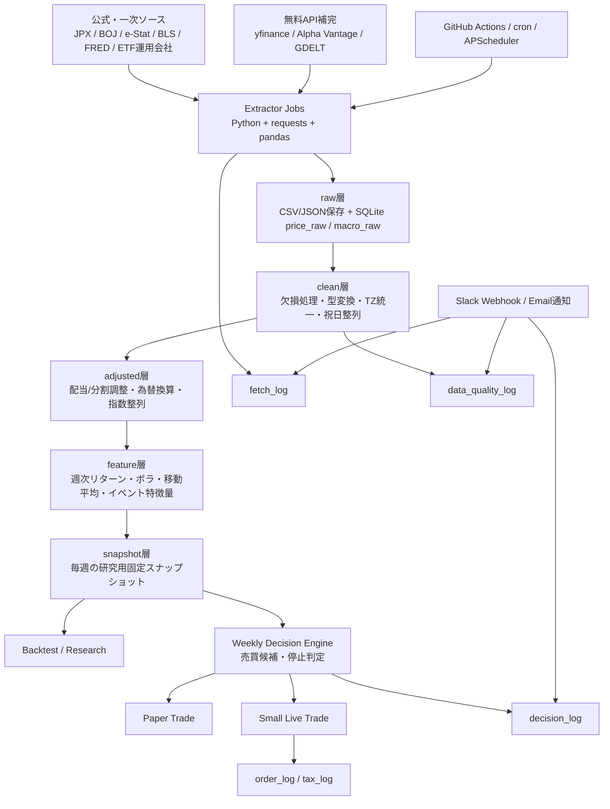

# 無料で自動構築できるAIトレーディング用の学習基盤とデータパイプライン

RenCrowの前提条件だと、**最初に作るべきものは「儲かるモデル」ではなく「壊れない研究基盤」**です。週1回売買・ETF中心・初期資金100万円という条件では、ティック配信や高速売買より、**日次/週次データの正確な保存、調整、スナップショット化、監査ログ**の方が成績に直結します。公式・一次ソースを優先し、無料APIは補完に回し、`raw → clean → adjusted → feature → snapshot` の層を分ける設計が、再現性と検証可能性の面で最も妥当です。e-Stat、BOJ、JPX、FRED/ALFRED、BLS などの公式情報は無料で取得でき、GitHub Actions、SQLite、Google Drive、Neon/Supabase の無料枠でも、RenCrow規模の研究基盤は十分に構築できます。citeturn5search1turn5search3turn28search2turn20search0turn20search3turn3search0turn15search2turn6search0turn6search6turn6search7turn13search12

## 設計原則と推奨アーキテクチャ

RenCrow向けの学習基盤は、**研究系**と**実運用系**を物理的ではなく論理的に分けるのがよいです。研究系は「データ収集・検証・特徴量生成・バックテスト」、実運用系は「週次判定・売買停止判定・小額執行」に限定します。特に個人運用では、公式ソースに近いものほど更新頻度が低く、無料APIほど便利だが利用条件や安定性に注意が必要です。そのため、**価格は無料APIで広く、重要イベントとマクロは公式、ETF構成変化は運用会社の公開 holdings/Excel、指数構成変更の先行情報は原則追わず**という配分が合理的です。JPXの指数構成銘柄や将来変更予告は有料サービスとして提供されているため、無料構成ではETF運用会社の保有明細差分を使う設計の方が現実的です。citeturn16search2turn18view1turn19view0



この構成の狙いは、**後から何度でも同じ週次判断を再現できること**です。FRED は ALFRED を通じて「その時点で見えていた経済データの版」を扱えますし、e-Stat は API と公表予定一覧を提供し、BOJ も時系列データ検索と為替日次データを公開しています。つまり、価格だけでなく**「その時点で利用可能だった情報」ごと保存できる**ため、先読みバイアスをかなり減らせます。citeturn15search0turn15search2turn5search6turn20search0turn28search2

コンポーネントの役割を短く整理すると、`Extractor` は取得、`Validator` は欠損や異常値の検査、`Adjuster` は配当・分割・為替の補正、`Feature Builder` は週次学習特徴量の生成、`Snapshotter` は毎週の固定研究データ生成、`Scheduler` は定時実行、`Notifier` は障害通知、`Audit Logger` は取得・判定・注文の痕跡保存です。GitHub Actions は cron ベースの定期実行と手動実行 `workflow_dispatch` の両方に対応し、Secrets 管理も可能です。citeturn6search1turn6search5turn6search9turn32search0turn32search2

## 無料で使えるデータソースと優先順位

RenCrow向けには、**公式ソースを「真実の基準」、無料APIを「取得の便利さ」、ニュースは「イベント補助」**として分けるのが安定します。以下の表は、初心者でも実装しやすく、かつ将来の拡張性が高い組み合わせだけに絞っています。

| 用途 | 推奨ソース | 取得方法 | 無料性と制限 | 信頼度 | 実務上の位置づけ | サンプル呼び出し |
|---|---|---|---|---|---|---|
| ETF・指数・株価の日次/週次（配当調整込） | yfinance / Yahoo Finance 公開APIラッパー citeturn2search0turn2search1turn2search2 | Python `yfinance.download()` / `Ticker.history()` | 無料。ただし **Yahoo非公式**、研究・教育・個人利用前提、安定性は保証されない citeturn2search0turn2search2 | 中 | MVPの主価格ソース。**本番前に別ソース検算必須** | `yf.download("2558.T", start="2020-01-01", auto_adjust=False, actions=True)` |
| 為替（USD/JPY, EUR/USD 等） | BOJ 外国為替市況（日次） / BOJ 時系列検索 citeturn20search0turn20search3turn28search2 | HTML/CVS/API系取得 | 無料。BOJが毎営業日公表、長期は時系列検索利用可 citeturn20search0turn20search1turn28search2 | 高 | 日本居住のETF運用では最優先の公式為替ソース | `BOJ FX daily page / 時系列検索API` |
| 金利・米国債利回り・Fed系指標 | FRED / ALFRED、または Alpha Vantageの金利系エンドポイント citeturn15search2turn15search0turn10view3 | FRED REST API / Alpha Vantage API | FRED無料。ALFREDで改定履歴も利用可。Alpha Vantageは無料枠が少ない citeturn15search0turn15search4turn1search11 | 高 | マクロ研究とバックテスト再現の中心 | `https://api.stlouisfed.org/fred/series/observations?...` `https://www.alphavantage.co/query?function=TREASURY_YIELD...` |
| 日本マクロ統計 | e-Stat API / 統計局公表予定 citeturn5search1turn5search3turn29view2turn5search6 | REST API | 無料。**appId 必須**、JSON/CSV取得可 citeturn29view1turn29view2 | 高 | 日本CPI・労働力調査・各種統計の正本 | `https://api.e-stat.go.jp/rest/3.0/app/json/getStatsData?...` |
| BOJ会合・日本金融政策日程 | BOJ 公表予定 / 金融政策決定会合の運営 citeturn4search5turn4search13 | HTMLスクレイプ/MVPは手動登録でも可 | 無料 | 高 | 週次売買の**イベント停止判定**に使う | `BOJ 公表予定ページを定期巡回` |
| 米国マクロ公表日程 | BLS Release Calendar / FRED release info citeturn4search3turn4search7turn15search5 | HTML / API混在 | 無料 | 高 | CPI・雇用統計前後の警戒に使う | `BLS release calendar page` |
| JPX営業日・祝日 | JPXカレンダー citeturn3search0turn3search4 | HTML | 無料 | 高 | 週次判定日・リバランス日の営業日補正 | `JPX calendar page` |
| ETFの組入変更 | NEXT FUNDS 組入全銘柄情報、BlackRock holdings CSV citeturn18view1turn19view0 | Excel/CSVダウンロード | 無料。月末/更新日のズレあり。JPXの公式指数変更予告は有料 citeturn16search2turn18view1turn19view0 | 中〜高 | 無料構成では**issuer holdings差分**が最善 | `issuer holdings Excel/CSV diff` |
| 上場/上場廃止状態 | Alpha Vantage LISTING_STATUS citeturn27view0 | CSV API | 無料APIだが回数制限あり citeturn1search11turn27view0 | 中 | 個別資産やETF寿命管理の補助 | `https://www.alphavantage.co/query?function=LISTING_STATUS&apikey=...` |
| 決算/経済イベント補完 | Alpha Vantage earnings calendar citeturn27view0 | CSV API | 無料枠少なめ citeturn1search11turn27view0 | 中 | 研究用のイベントフラグ補助 | `...function=EARNINGS_CALENDAR...` |
| ニュース見出し | GDELT DOC 2.0 API + 公式発表ページ群 citeturn8search6turn8search27 | HTTP API | 無料。直近3か月、関連度上位見出し取得向き citeturn8search27 | 中 | **本文収集ではなく見出し要約用** | `GDELT DOC query` |

この表の中で、**最も重要なのは「1つのソースで全部やらない」こと**です。Yahoo系は便利ですが非公式で、FRED は強力ですが株価は弱く、JPX/日経は権利や提供形態の制約があります。したがって、RenCrowでは次の優先順がおすすめです。価格は `yfinance` を主、BOJ/JPX/FRED/e-Stat を真実の補助線、ETF構成差分は運用会社公開ファイル、ニュースは GDELT と公式発表見出しだけに限定、です。citeturn2search0turn2search2turn15search4turn26view1turn26view0

また、**データの再配布や外部公開は避ける**べきです。yfinance は個人・研究利用前提、FRED の一部シリーズには第三者権利制約があり、JPX/QUICKデータは蓄積・編集・加工や第三者提供が禁止され、日経指数も機械処理や外部発信・表示にはライセンス論点があります。研究は自己利用に限定し、RenCrowから第三者へシグナル配信しない設計が安全です。citeturn2search2turn15search4turn26view1turn26view0

## 最小実装の作り方

最小実装は、**SQLite 一つと GitHub Actions、そして 5 本の Python スクリプト**で始めるのが最も良いです。SQLite は Python 標準 `sqlite3` で扱え、ディスク上ファイルとしてそのままバックアップできます。プロトタイプから PostgreSQL に移行しやすい点も利点です。citeturn13search1turn13search5

推奨するMVPのディレクトリは次のとおりです。

```text
rencrow-data/
  data/
    rencrow.db
    snapshots/
    raw_cache/
  src/
    01_init_db.py
    02_fetch_market.py
    03_fetch_macro.py
    04_build_features.py
    05_detect_events.py
    06_make_snapshot.py
  .github/workflows/
    daily_ingest.yml
    weekly_snapshot.yml
  config/
    instruments.yml
    calendars.yml
  logs/
```

### 必要スクリプト

`01_init_db.py` はテーブル作成、`02_fetch_market.py` は価格と corporate actions の取得、`03_fetch_macro.py` は FRED/e-Stat/BOJ などの取得、`04_build_features.py` は週次特徴量生成、`05_detect_events.py` は大幅変動・イベント前後フラグ、`06_make_snapshot.py` は週次スナップショットの固定化です。これだけで、**毎週の学習・検証・ペーパートレード前段**まで回ります。GitHub Actions は `schedule` と `workflow_dispatch` の両方を設定し、重要イベント時だけ手動再実行できるようにします。citeturn6search1turn6search5turn6search9

### DBスキーマ

最初から複雑な星型スキーマにせず、**監査できる正規化 + スナップショット用の派生テーブル**で十分です。

```sql
CREATE TABLE IF NOT EXISTS instruments (
  instrument_id INTEGER PRIMARY KEY,
  symbol TEXT NOT NULL UNIQUE,
  name TEXT,
  asset_type TEXT,          -- ETF / INDEX / FX / RATE / MACRO
  venue TEXT,               -- TSE / BOJ / FRED / etc.
  currency TEXT,
  timezone TEXT,
  active INTEGER DEFAULT 1,
  created_at TEXT DEFAULT CURRENT_TIMESTAMP
);

CREATE TABLE IF NOT EXISTS source_fetch_log (
  fetch_id INTEGER PRIMARY KEY,
  source_name TEXT NOT NULL,
  endpoint TEXT,
  requested_at TEXT NOT NULL,
  finished_at TEXT,
  status TEXT NOT NULL,     -- success / fail / partial
  http_status INTEGER,
  rows_fetched INTEGER,
  checksum TEXT,
  error_message TEXT
);

CREATE TABLE IF NOT EXISTS price_raw (
  instrument_id INTEGER NOT NULL,
  trade_date TEXT NOT NULL,
  open REAL, high REAL, low REAL, close REAL,
  adj_close REAL,
  volume REAL,
  source_name TEXT NOT NULL,
  fetch_id INTEGER,
  PRIMARY KEY (instrument_id, trade_date, source_name)
);

CREATE TABLE IF NOT EXISTS corporate_action (
  instrument_id INTEGER NOT NULL,
  action_date TEXT NOT NULL,
  action_type TEXT NOT NULL,   -- dividend / split / delist / merge
  value REAL,
  source_name TEXT NOT NULL,
  fetch_id INTEGER,
  PRIMARY KEY (instrument_id, action_date, action_type, source_name)
);

CREATE TABLE IF NOT EXISTS macro_series (
  series_code TEXT NOT NULL,
  obs_date TEXT NOT NULL,
  value REAL,
  vintage_date TEXT,           -- ALFRED等の改定版管理
  release_date TEXT,
  source_name TEXT NOT NULL,
  fetch_id INTEGER,
  PRIMARY KEY (series_code, obs_date, COALESCE(vintage_date,''), source_name)
);

CREATE TABLE IF NOT EXISTS economic_calendar (
  event_id INTEGER PRIMARY KEY,
  event_date TEXT NOT NULL,
  country TEXT,
  category TEXT,               -- CPI / Employment / BOJ / FOMC ...
  event_name TEXT NOT NULL,
  source_name TEXT NOT NULL,
  importance TEXT,             -- low / med / high / critical
  last_checked_at TEXT
);

CREATE TABLE IF NOT EXISTS etf_holding_snapshot (
  instrument_id INTEGER NOT NULL,
  snapshot_date TEXT NOT NULL,
  constituent_code TEXT NOT NULL,
  constituent_name TEXT,
  weight REAL,
  quantity REAL,
  source_name TEXT NOT NULL,
  fetch_id INTEGER,
  PRIMARY KEY (instrument_id, snapshot_date, constituent_code, source_name)
);

CREATE TABLE IF NOT EXISTS feature_weekly (
  instrument_id INTEGER NOT NULL,
  week_end TEXT NOT NULL,
  ret_1w REAL,
  ret_4w REAL,
  vol_12w REAL,
  ma_4w_gap REAL,
  drawdown_26w REAL,
  fx_ret_1w REAL,
  event_risk_score REAL,
  PRIMARY KEY (instrument_id, week_end)
);

CREATE TABLE IF NOT EXISTS event_log (
  event_ts TEXT NOT NULL,
  scope TEXT NOT NULL,         -- market / macro / etf / system
  level TEXT NOT NULL,         -- info / warn / stop
  reason TEXT NOT NULL,
  value REAL,
  context_json TEXT
);

CREATE TABLE IF NOT EXISTS snapshot_registry (
  snapshot_id INTEGER PRIMARY KEY,
  snapshot_date TEXT NOT NULL UNIQUE,
  db_hash TEXT NOT NULL,
  features_hash TEXT NOT NULL,
  notes TEXT
);
```

この構成にした理由は、**raw を消さず、adjusted を後計算にでき、snapshot を固定できる**からです。e-Stat や FRED/ALFRED は改定が起きるため、`release_date` や `vintage_date` の列を最初から持っておくと、将来の検証で効きます。citeturn15search0turn15search2turn29view2

### スケジュール設定

週1回売買なら、日次ジョブは「学習基盤の更新」、週次ジョブは「判断用 snapshot 作成」と割り切るのが安全です。GitHub Actions は UTC 既定なので、JST で動かしたければ `timezone` を使うか、UTC換算で書きます。最短実行間隔は5分です。citeturn6search5

| ジョブ | 推奨頻度 | 内容 | 停止条件 |
|---|---|---|---|
| market ingest | 平日 17:30 JST | 価格・出来高・actions取得、BOJ FX更新 | 主要ETFの当日バー欠損 |
| macro ingest | 平日 19:00 JST | e-Stat/BOJ/FRED/BLSカレンダー更新 | APIエラー連続3回 |
| feature build | 毎週 土曜 08:00 JST | 週次特徴量再計算 | required series の stale |
| snapshot build | 毎週 土曜 08:30 JST | `snapshot_registry` 固定、研究用CSV出力 | feature build 失敗 |
| event override | 手動 | FOMC/BOJ/CPI前後の再実行 | なし |

### 保存先の具体案

いちばんおすすめは、**ローカル or 小型VPS/自宅PC上の SQLite を正本**にして、**Google Drive に圧縮バックアップ**、**GitHub にはコードと設定のみ**を置く形です。Google アカウントは 15GB の無料保存枠があり、RenCrow規模なら SQLite の圧縮バックアップと snapshot CSV を十分保存できます。GitHub Actions は public repo なら標準ランナーが無料、private repo は利用分に上限があります。秘密情報は GitHub Secrets に入れます。citeturn13search12turn6search8turn6search0turn6search4turn32search0turn32search2

もしスマホや別PCからも見たいなら、SQLite正本はそのまま維持しつつ、`feature_weekly` と `snapshot_registry` だけを Neon か Supabase の無料 PostgreSQL に複製すると便利です。Neon は無料プランで 0.5GB / project、Supabase free は 2 projects / 2GB disk 規模です。RenCrowの週次研究には十分です。citeturn6search6turn6search7turn6search11turn6search3

## 中級実装とデータ品質の作り込み

MVP が回ったら、次は**フィーチャーストア、バックテスト・スナップショット、イベント検知、ニュース見出し要約**を足します。ここで重要なのは、機械学習を急がず、**データの意味が壊れていないこと**を先に確認することです。

### フィーチャーストア

中級実装では `feature_weekly` を単なる計算結果ではなく、**学習に使った週次特徴量の固定テーブル**として扱います。おすすめは次の特徴量です。

- 1週・4週・12週リターン
- 12週ボラティリティ
- 26週最大ドローダウン
- 4週/12週移動平均乖離
- 出来高変化率
- USD/JPY 1週変化
- 10年金利変化
- BOJ/CPI/FOMC 前後フラグ
- ETF保有銘柄の入替率
- 見出しベースのイベント密度

この程度でも、RenCrow の時間軸なら十分に「学習基盤」になります。FRED/ALFRED は予想以上に強力で、`vintage_dates` や `output_type` を使えば、過去のある時点で見えていたマクロ値を再構成できます。これは本物の再現性に効きます。citeturn31search0turn15search0

### バックテスト用スナップショット

毎週土曜に `rencrow_snapshot_YYYYMMDD.sqlite.gz` か `snapshot_YYYYMMDD.parquet` を作り、`snapshot_registry` に DB ハッシュを記録します。こうしておくと、**「その週のデータで何を判断したか」を後で完全再演**できます。ALFRED でマクロ改定、yfinance で履歴修正、ETF holdings の差し替えが起きても、研究結果がぶれません。これは個人運用ではかなり重要です。citeturn15search0turn15search2

### イベント検知

イベント検知は「ニュース解釈AI」ではなく、**通常運転を止める安全装置**として始めるのが最善です。無料でできる最小形は、次の 3 系統です。

第一に、**価格ベース**です。1日変動率、5日ボラ、出来高スパイクを z-score 化して異常判定します。  
第二に、**カレンダーベース**です。BOJ 会合、CPI、雇用統計、BLS release、e-Stat 公表予定を前日からフラグにします。citeturn4search13turn4search5turn5search6turn4search3turn4search7  
第三に、**構成変化ベース**です。ETF holdings を前月と比較し、上位10銘柄の入替率やセクター比率変化を出します。NEXT FUNDS は月末時点の全銘柄Excelを、BlackRock は holdings/analytics を公開しています。citeturn18view1turn19view0

### 簡易ニュース要約

見出し要約は、**本文を保存しない**のがポイントです。GDELT DOC 2.0 API は、直近3か月を対象に関連度上位の見出し群を返せるため、たとえば「Japan inflation」「BOJ」「semiconductor」「tariff」などの絞り込みで、1日1回だけ見出しを取得し、ローカルで 3 行要約を作ると十分です。公式発表ページ（BOJ、JPX、BLS、e-Stat）も合わせれば、無料でもかなり使えます。citeturn8search27turn8search6turn4search13turn16search3turn4search11turn5search6

## データ調整アルゴリズムと自動化

### 分割・配当・欠損・上場廃止・為替調整

価格系列で最低限必要なのは、**分割・配当・欠損・市場休業日・為替基準**の5点です。yfinance は `actions=True` と `auto_adjust` を持ち、Alpha Vantage には上場/上場廃止状態を調べる `LISTING_STATUS` があります。BOJ は日次為替を公開しています。citeturn2search1turn27view0turn20search0

実装上の一番簡単な方法は、`raw` に `close` と `adj_close` を保存し、**調整係数 `factor = adj_close / close`** を各日で持つことです。そうすると調整済み OHLC は `raw_ohlc * factor` で再構成できます。配当込み total return を自前で作りたい場合は、分割補正済み終値 `P_t` と配当 `D_t` を使って、  
`TR_t = TR_{t-1} * (P_t + D_t) / P_{t-1}`  
とするのが素直です。これは ETF を長期比較するときに有効です。`auto_adjust=True` に丸投げせず、**raw と factor の両方を残す**のが監査向きです。citeturn2search1turn10view0

欠損処理は、**休場による欠損**と**取得失敗による欠損**を必ず分けます。JPX カレンダーで営業日を引き、営業日なのにバーが欠けていれば「取得異常」、休場なら「正常欠損」です。週次運用ではここを曖昧にしないだけで事故が減ります。citeturn3search0turn3search4

上場廃止や銘柄寿命は ETF 中心だと頻度は低いですが、研究では残すべきです。Alpha Vantage の `LISTING_STATUS` は active/delisted を日付指定で返せるので、**当時の投資可能集合の近似**に使えます。指数やETFの交代が発生したら `active=0` にして履歴は残し、シンボル再利用は別 `instrument_id` に分けます。citeturn27view0

為替調整は、たとえば米国ETFのリターンを円ベースで見たい場合、  
`JPY_total_return ≈ USD_asset_return + USDJPY_return + 交差項`  
の簡易近似でもよく、厳密には円換算価格を毎日作ってから週次集計します。BOJ がドル円の日次スポットを公表しているため、日本居住の資産評価には十分です。citeturn20search0turn20search1

### 擬似コード

```text
for symbol in universe:
    raw = fetch_price_history(symbol, auto_adjust=False, actions=True)
    save price_raw(raw.OHLCV, raw.adj_close)
    save corporate_action(raw.dividends, raw.splits)

for each instrument/date:
    if close is not null and adj_close is not null and close != 0:
        factor = adj_close / close
        adjusted_open  = open  * factor
        adjusted_high  = high  * factor
        adjusted_low   = low   * factor
        adjusted_close = close * factor

for each trading day:
    expected_open = JPX_or_source_calendar(day)
    if expected_open and price missing:
        mark quality_error("missing_required_bar")

for USD assets:
    fx = BOJ_USDJPY(day)
    jpy_close = adjusted_close_usd * fx

for each week_end:
    ret_1w = jpy_close[t] / jpy_close[t-5] - 1
    vol_12w = std(daily_returns[t-60:t]) * sqrt(252)
    event_flag = macro_calendar within +/- 2 business days
    save feature_weekly

monthly:
    holdings_now = download_holdings(etf, month_end)
    holdings_prev = previous_snapshot(etf)
    add_drop_rate = symmetric_difference(holdings_now, holdings_prev)
    sector_shift = sector_weight_diff(holdings_now, holdings_prev)
    log event if add_drop_rate > threshold or sector_shift > threshold
```

### GitHub Actions と cron と Prefect代替

無料で始めるなら、**第一選択は GitHub Actions**、常時稼働PCがあるなら **cron + Python venv**、ジョブ管理を見やすくしたくなったら **APScheduler**、さらに UI とフロー管理が欲しければ **self-hosted Prefect** です。GitHub Actions は schedule / manual dispatch に対応し、Secrets を安全に注入できます。APScheduler は Python プロセス内で job/schedule を管理しやすく、Prefect は self-host 可能ですが、複数サーバー運用では PostgreSQL や Redis が必要になり、MVPには少し重いです。citeturn6search1turn6search5turn32search2turn22search1turn22search3turn22search0turn22search4

GitHub Actions の最小例はこうです。

```yaml
name: daily-ingest
on:
  schedule:
    - cron: "30 8 * * 1-5"   # JST 17:30 相当の例
  workflow_dispatch:

jobs:
  ingest:
    runs-on: ubuntu-latest
    steps:
      - uses: actions/checkout@v4
      - uses: actions/setup-python@v5
        with:
          python-version: "3.12"
      - run: pip install -r requirements.txt
      - run: python src/02_fetch_market.py
        env:
          ALPHA_VANTAGE_API_KEY: ${{ secrets.ALPHA_VANTAGE_API_KEY }}
          FRED_API_KEY: ${{ secrets.FRED_API_KEY }}
      - run: python src/03_fetch_macro.py
      - run: python src/04_build_features.py
      - run: python src/05_detect_events.py
      - name: alert on failure
        if: failure()
        run: |
          curl -X POST -H 'Content-type: application/json' \
          --data '{"text":"RenCrow ingest failed"}' \
          ${{ secrets.SLACK_WEBHOOK_URL }}
```

GitHub の schedule は cron で実行でき、手動実行もできます。Slack Incoming Webhooks は単純な JSON POST で通知できるので、無料構成のアラートには十分です。GitHub 側の通知設定を有効にすれば、失敗時にメール通知も受けられます。citeturn6search5turn6search9turn7search0turn7search1turn7search7

障害時の再試行ルールは、**データソースごとに分ける**のがよいです。  
市場データは `3回まで指数バックオフ (60s, 180s, 600s)`、  
マクロカレンダーは `翌日再試行`、  
BOJ/JPX/統計局の主要イベント取得失敗は `warn` ではなく `stop_trade_candidate` にします。  
理由は、週1回売買では「取りこぼしより誤判断」の方が痛いからです。

## コスト、セキュリティ、バックアップ、法的注意

### どこまで無料で可能か

RenCrow規模なら、**研究基盤はかなりの部分が無料**です。  
価格・出来高・分割配当は yfinance、マクロは e-Stat / BOJ / FRED / BLS、スケジューラは GitHub Actions または cron、DBは SQLite、バックアップは Google Drive 15GB で回せます。GitHub Actions の public repo は標準ランナー無料、private repo は分数制限があります。GCP には Free Tier と 90日/$300 の trial、Cloud Run や Cloud Storage Always Free があります。AWS は現在、従来の長期「無料利用枠」よりも、**新規向けクレジット型**の色合いが強くなっているため、初心者の常設基盤としては GCP/Neon/Supabase の方が扱いやすいです。citeturn6search8turn6search4turn13search12turn25search0turn25search1turn24search2turn24search4turn24search9turn24search13

| 段階 | 推奨構成 | 月額の目安 | 使う理由 |
|---|---|---:|---|
| 完全無料MVP | ローカルPC + SQLite + GitHub Actions + Drive | 0円 | まず壊れない研究基盤を作る |
| 無料拡張 | SQLite正本 + Neon/Supabase複製 | 0円 | 外出先閲覧、簡易ダッシュボード |
| 低額クラウド | 小型VPS or Cloud Run + Postgres | 数百〜数千円 | 常時稼働・複数ジョブ |
| 本格化 | 管理DB + ワーカー分離 + オブジェクトストレージ | 数千円〜 | 長期運用・複数戦略 |

### 段階的移行プラン

移行順は、**SQLiteを捨てない**ことが重要です。

1. **MVP**  
   SQLite正本、日次更新、週次 snapshot、価格・マクロ・イベントだけ。  
2. **研究拡張**  
   ETF holdings 差分、ALFRED vintage、イベント要約、paper trade を追加。  
3. **可視化**  
   PostgreSQL 複製、簡易 dashboard、通知改善。  
4. **小額実運用**  
   監査ログ・ストップ条件・税務記録を強化してから執行接続。  

### セキュリティとバックアップ

Secrets は GitHub Actions Secrets を使い、API キーや webhook URL をコードに直書きしません。GitHub には push protection や secret scanning の仕組みもありますが、public/private で使える機能差があるため、**最初から「鍵は絶対コミットしない」運用**にした方が確実です。citeturn32search0turn32search2turn32search7turn32search11turn32search14

おすすめのバックアップ設計は次のとおりです。

- **毎日**: `rencrow.db.zst` を Drive に上書き保存  
- **毎週**: `snapshot_YYYYMMDD.sqlite.gz` を別名保存  
- **毎月**: `feature_weekly.parquet`, `event_log.csv`, `decision_log.csv` をアーカイブ  
- **コード**: GitHub  
- **設定**: `config/*.yml` を Git 管理  
- **APIキー**: GitHub Secrets / `.env` のみ

保存期間は法定年限と断言せず、**内部統制ポリシーとして7年保管**をおすすめします。特に `約定履歴、特定口座年間取引報告書、入出金、売買理由、使用データ版、注文失敗ログ` は長く残す価値があります。NTA は特定口座年間取引報告書の電子交付・申告利用を案内しているため、税務の実務でも重要です。citeturn14search2turn14search6turn14search10turn14search12

### 個人運用での法規制・コンプライアンス注意点

日本在住の個人運用としては、まず **高頻度売買の世界に近づかない**ことが大事です。金融庁は高速取引行為について登録制度を設けています。RenCrow は週1回前後の売買を前提にしているので、ここに近づかない設計自体が安全側です。citeturn0search1turn0search5

次に、**他人に継続的な助言やシグナル配信をしない**ことです。関東財務局は、投資助言・代理業を開始するには事前登録が必要と案内しています。自分だけで使う研究基盤と、自動売買の助言を第三者へ提供するサービスは、法的に重さが違います。RenCrow はあくまで自己利用に限定するのがよいです。citeturn0search2turn0search6

また、NISA は課税口座と損益通算できず、課税口座の資産を後から NISA に移管することもできません。したがって、**NISA の長期投信は別管理、RenCrow の学習・検証・実運用は課税口座側で行う**という前提は合理的です。これは制度上も整合的です。citeturn14search1turn23search1turn14search7

最後に、データライセンスです。JPX/QUICK のサイト情報は蓄積・編集・加工や第三者提供が禁じられ、日経指数データも機械処理や対外発信でライセンス論点があります。無料データは**自己研究用**に閉じ、レポートや可視化も外部配布しない運用が無難です。citeturn26view1turn26view0

## 実運用の停止条件と参考コード

### 売買停止チェックリスト

RenCrow が小額実運用に入る前に、毎週の判定前に最低限これだけは見てください。

- 必須ETF・為替・金利の最新バーがそろっているか  
- 直近の `source_fetch_log` に fail / partial が残っていないか  
- 前回週の snapshot が固定済みか  
- BOJ / CPI / 雇用 / FOMC の前後2営業日か  
- ETF holdings が古すぎないか  
- 週次 feature の欠損率が閾値以下か  
- 価格が前日比で異常跳ねしていないか  
- APIキー期限切れや webhook エラーがないか  
- NISA口座の資産を誤って参照・混在していないか  
- 税務用に約定・理由・時刻・注文結果を保存しているか  

停止条件の実務ルールは、たとえば以下で十分です。

- required sources のどれかが stale > 48h  
- required price bar 欠損  
- adjusted factor が前日から異常変化  
- event_risk_score が critical  
- 主要イベント前後で人間確認未済  
- holdings snapshot が 40日超更新なし  
- DB migration や schema change 後の再検証未完了  

### 参考実装コード

以下は、**価格取得、SQLite保存、配当/分割調整、週次特徴量生成、簡易イベント検知**までを一つにまとめた最小サンプルです。`yfinance` は research/personal use 前提なので、実運用前には BOJ/FRED/issuer data で検算してください。citeturn2search0turn2search2

```python
# requirements:
# pip install yfinance pandas requests

from __future__ import annotations
import json
import math
import sqlite3
from pathlib import Path
from datetime import datetime, timezone
from typing import Iterable

import pandas as pd
import requests
import yfinance as yf

DB_PATH = Path("data/rencrow.db")
DB_PATH.parent.mkdir(parents=True, exist_ok=True)

ETF_SYMBOLS = [
    "1306.T",   # TOPIX ETF
    "2558.T",   # S&P500 ETF (example)
    "1545.T",   # NASDAQ100 linked ETF (example)
    "2510.T",   # domestic bond ETF
    "1328.T",   # gold ETF
]
FX_SYMBOL = "JPY=X"   # Yahoo上では USDJPY inverse注意。実利用時はBOJ基準で検算推奨。

def utcnow_iso() -> str:
    return datetime.now(timezone.utc).isoformat()

def connect_db() -> sqlite3.Connection:
    con = sqlite3.connect(DB_PATH)
    con.execute("PRAGMA journal_mode=WAL;")
    con.execute("PRAGMA synchronous=NORMAL;")
    return con

def init_db(con: sqlite3.Connection) -> None:
    con.executescript("""
    CREATE TABLE IF NOT EXISTS instruments (
      instrument_id INTEGER PRIMARY KEY,
      symbol TEXT NOT NULL UNIQUE,
      name TEXT,
      asset_type TEXT,
      venue TEXT,
      currency TEXT,
      timezone TEXT,
      active INTEGER DEFAULT 1,
      created_at TEXT DEFAULT CURRENT_TIMESTAMP
    );

    CREATE TABLE IF NOT EXISTS source_fetch_log (
      fetch_id INTEGER PRIMARY KEY,
      source_name TEXT NOT NULL,
      endpoint TEXT,
      requested_at TEXT NOT NULL,
      finished_at TEXT,
      status TEXT NOT NULL,
      http_status INTEGER,
      rows_fetched INTEGER,
      checksum TEXT,
      error_message TEXT
    );

    CREATE TABLE IF NOT EXISTS price_raw (
      instrument_id INTEGER NOT NULL,
      trade_date TEXT NOT NULL,
      open REAL, high REAL, low REAL, close REAL,
      adj_close REAL,
      volume REAL,
      source_name TEXT NOT NULL,
      fetch_id INTEGER,
      PRIMARY KEY (instrument_id, trade_date, source_name)
    );

    CREATE TABLE IF NOT EXISTS corporate_action (
      instrument_id INTEGER NOT NULL,
      action_date TEXT NOT NULL,
      action_type TEXT NOT NULL,
      value REAL,
      source_name TEXT NOT NULL,
      fetch_id INTEGER,
      PRIMARY KEY (instrument_id, action_date, action_type, source_name)
    );

    CREATE TABLE IF NOT EXISTS feature_weekly (
      instrument_id INTEGER NOT NULL,
      week_end TEXT NOT NULL,
      ret_1w REAL,
      ret_4w REAL,
      vol_12w REAL,
      ma_4w_gap REAL,
      drawdown_26w REAL,
      event_risk_score REAL,
      PRIMARY KEY (instrument_id, week_end)
    );

    CREATE TABLE IF NOT EXISTS event_log (
      event_ts TEXT NOT NULL,
      scope TEXT NOT NULL,
      level TEXT NOT NULL,
      reason TEXT NOT NULL,
      value REAL,
      context_json TEXT
    );
    """)
    con.commit()

def upsert_instrument(con: sqlite3.Connection, symbol: str, name: str | None = None,
                      asset_type: str = "ETF", venue: str = "YAHOO",
                      currency: str = "JPY", tz: str = "Asia/Tokyo") -> int:
    con.execute("""
        INSERT INTO instruments(symbol, name, asset_type, venue, currency, timezone)
        VALUES (?, ?, ?, ?, ?, ?)
        ON CONFLICT(symbol) DO UPDATE SET
            name=COALESCE(excluded.name, instruments.name),
            asset_type=excluded.asset_type,
            venue=excluded.venue,
            currency=excluded.currency,
            timezone=excluded.timezone
    """, (symbol, name, asset_type, venue, currency, tz))
    row = con.execute("SELECT instrument_id FROM instruments WHERE symbol = ?", (symbol,)).fetchone()
    assert row is not None
    return int(row[0])

def start_fetch_log(con: sqlite3.Connection, source_name: str, endpoint: str) -> int:
    con.execute("""
        INSERT INTO source_fetch_log(source_name, endpoint, requested_at, status)
        VALUES (?, ?, ?, 'running')
    """, (source_name, endpoint, utcnow_iso()))
    fetch_id = con.execute("SELECT last_insert_rowid()").fetchone()[0]
    con.commit()
    return int(fetch_id)

def end_fetch_log(con: sqlite3.Connection, fetch_id: int, status: str,
                  rows_fetched: int = 0, http_status: int | None = None,
                  error_message: str | None = None) -> None:
    con.execute("""
        UPDATE source_fetch_log
        SET finished_at = ?, status = ?, rows_fetched = ?, http_status = ?, error_message = ?
        WHERE fetch_id = ?
    """, (utcnow_iso(), status, rows_fetched, http_status, error_message, fetch_id))
    con.commit()

def fetch_yahoo_history(symbol: str, start: str = "2015-01-01") -> pd.DataFrame:
    df = yf.download(
        symbol,
        start=start,
        auto_adjust=False,
        actions=True,
        progress=False,
        threads=False,
    )
    if df.empty:
        raise ValueError(f"No data returned for {symbol}")
    # MultiIndex対策
    if isinstance(df.columns, pd.MultiIndex):
        df.columns = [c[0] for c in df.columns]
    df = df.rename(columns=str.lower)
    df.index = pd.to_datetime(df.index).tz_localize(None)
    required = {"open", "high", "low", "close", "adj close", "volume"}
    missing = required - set(df.columns)
    if missing:
        raise ValueError(f"Missing columns for {symbol}: {missing}")
    df["adj_close"] = df["adj close"]
    df["dividends"] = df.get("dividends", 0.0).fillna(0.0)
    df["stock_splits"] = df.get("stock splits", 0.0).fillna(0.0)
    return df[["open", "high", "low", "close", "adj_close", "volume", "dividends", "stock_splits"]]

def save_price_history(con: sqlite3.Connection, instrument_id: int, df: pd.DataFrame, fetch_id: int) -> None:
    rows = []
    action_rows = []
    for dt, r in df.iterrows():
        trade_date = pd.Timestamp(dt).date().isoformat()
        rows.append((
            instrument_id, trade_date,
            float(r["open"]) if pd.notna(r["open"]) else None,
            float(r["high"]) if pd.notna(r["high"]) else None,
            float(r["low"]) if pd.notna(r["low"]) else None,
            float(r["close"]) if pd.notna(r["close"]) else None,
            float(r["adj_close"]) if pd.notna(r["adj_close"]) else None,
            float(r["volume"]) if pd.notna(r["volume"]) else None,
            "yfinance", fetch_id
        ))
        if pd.notna(r["dividends"]) and float(r["dividends"]) != 0.0:
            action_rows.append((instrument_id, trade_date, "dividend", float(r["dividends"]), "yfinance", fetch_id))
        if pd.notna(r["stock_splits"]) and float(r["stock_splits"]) != 0.0:
            action_rows.append((instrument_id, trade_date, "split", float(r["stock_splits"]), "yfinance", fetch_id))

    con.executemany("""
        INSERT OR REPLACE INTO price_raw(
            instrument_id, trade_date, open, high, low, close, adj_close, volume, source_name, fetch_id
        ) VALUES (?, ?, ?, ?, ?, ?, ?, ?, ?, ?)
    """, rows)

    con.executemany("""
        INSERT OR REPLACE INTO corporate_action(
            instrument_id, action_date, action_type, value, source_name, fetch_id
        ) VALUES (?, ?, ?, ?, ?, ?)
    """, action_rows)

    con.commit()

def build_adjusted_series(raw_df: pd.DataFrame) -> pd.DataFrame:
    """
    adj_factor = adj_close / close を使い、調整済みOHLCを再構成。
    """
    df = raw_df.copy().sort_values("trade_date")
    df["adj_factor"] = df["adj_close"] / df["close"]
    for c in ["open", "high", "low", "close"]:
        df[f"{c}_adj"] = df[c] * df["adj_factor"]
    return df

def compute_weekly_features(adj_df: pd.DataFrame) -> pd.DataFrame:
    df = adj_df.copy()
    df["trade_date"] = pd.to_datetime(df["trade_date"])
    df = df.set_index("trade_date").sort_index()

    px = df["close_adj"].astype(float).dropna()
    daily_ret = px.pct_change()

    weekly = pd.DataFrame(index=px.resample("W-FRI").last().index)
    weekly["close_w"] = px.resample("W-FRI").last()
    weekly["ret_1w"] = weekly["close_w"].pct_change(1)
    weekly["ret_4w"] = weekly["close_w"].pct_change(4)
    weekly["vol_12w"] = daily_ret.rolling(60).std().resample("W-FRI").last() * math.sqrt(252)
    weekly["ma_4w_gap"] = weekly["close_w"] / weekly["close_w"].rolling(4).mean() - 1.0

    rolling_max_26w = weekly["close_w"].rolling(26, min_periods=1).max()
    weekly["drawdown_26w"] = weekly["close_w"] / rolling_max_26w - 1.0

    weekly = weekly.drop(columns=["close_w"]).dropna(how="all")
    return weekly.reset_index().rename(columns={"trade_date": "week_end"})

def simple_event_detection(adj_df: pd.DataFrame) -> list[dict]:
    """
    シンプルな価格イベント検知:
    - 日次リターン絶対値が過去63営業日z-scoreで2.5超
    - 出来高が過去63営業日平均の2倍超
    """
    df = adj_df.copy()
    df["trade_date"] = pd.to_datetime(df["trade_date"])
    df = df.sort_values("trade_date")
    df["ret_1d"] = df["close_adj"].pct_change()
    mu = df["ret_1d"].rolling(63).mean()
    sd = df["ret_1d"].rolling(63).std()
    df["ret_z"] = (df["ret_1d"] - mu) / sd
    df["vol_avg_63"] = df["volume"].rolling(63).mean()

    events = []
    for _, r in df.tail(5).iterrows():
        if pd.notna(r["ret_z"]) and abs(float(r["ret_z"])) >= 2.5:
            level = "stop" if abs(float(r["ret_1d"])) >= 0.05 else "warn"
            events.append({
                "event_ts": utcnow_iso(),
                "scope": "market",
                "level": level,
                "reason": "return_spike",
                "value": float(r["ret_1d"]),
                "context_json": json.dumps({
                    "trade_date": str(pd.Timestamp(r["trade_date"]).date()),
                    "ret_z": float(r["ret_z"])
                }, ensure_ascii=False)
            })
        if pd.notna(r["vol_avg_63"]) and pd.notna(r["volume"]) and float(r["volume"]) > 2.0 * float(r["vol_avg_63"]):
            events.append({
                "event_ts": utcnow_iso(),
                "scope": "market",
                "level": "warn",
                "reason": "volume_spike",
                "value": float(r["volume"]),
                "context_json": json.dumps({
                    "trade_date": str(pd.Timestamp(r["trade_date"]).date()),
                    "avg_63": float(r["vol_avg_63"])
                }, ensure_ascii=False)
            })
    return events

def save_weekly_features(con: sqlite3.Connection, instrument_id: int, weekly: pd.DataFrame) -> None:
    rows = []
    for _, r in weekly.iterrows():
        week_end = pd.Timestamp(r["week_end"]).date().isoformat()
        rows.append((
            instrument_id,
            week_end,
            None if pd.isna(r.get("ret_1w")) else float(r["ret_1w"]),
            None if pd.isna(r.get("ret_4w")) else float(r["ret_4w"]),
            None if pd.isna(r.get("vol_12w")) else float(r["vol_12w"]),
            None if pd.isna(r.get("ma_4w_gap")) else float(r["ma_4w_gap"]),
            None if pd.isna(r.get("drawdown_26w")) else float(r["drawdown_26w"]),
            0.0,  # 後でカレンダーイベント統合して更新してもよい
        ))
    con.executemany("""
        INSERT OR REPLACE INTO feature_weekly(
            instrument_id, week_end, ret_1w, ret_4w, vol_12w, ma_4w_gap, drawdown_26w, event_risk_score
        ) VALUES (?, ?, ?, ?, ?, ?, ?, ?)
    """, rows)
    con.commit()

def save_events(con: sqlite3.Connection, events: Iterable[dict]) -> None:
    rows = [(e["event_ts"], e["scope"], e["level"], e["reason"], e["value"], e["context_json"]) for e in events]
    con.executemany("""
        INSERT INTO event_log(event_ts, scope, level, reason, value, context_json)
        VALUES (?, ?, ?, ?, ?, ?)
    """, rows)
    con.commit()

def main() -> None:
    con = connect_db()
    init_db(con)

    for symbol in ETF_SYMBOLS:
        instrument_id = upsert_instrument(con, symbol, asset_type="ETF", venue="TSE/YAHOO", currency="JPY")
        endpoint = f"yfinance:{symbol}"
        fetch_id = start_fetch_log(con, "yfinance", endpoint)
        try:
            hist = fetch_yahoo_history(symbol)
            save_price_history(con, instrument_id, hist, fetch_id)

            raw_df = pd.read_sql_query("""
                SELECT trade_date, open, high, low, close, adj_close, volume
                FROM price_raw
                WHERE instrument_id = ?
                ORDER BY trade_date
            """, con, params=(instrument_id,))
            adj_df = build_adjusted_series(raw_df)
            weekly = compute_weekly_features(adj_df)
            save_weekly_features(con, instrument_id, weekly)

            events = simple_event_detection(adj_df)
            save_events(con, events)

            end_fetch_log(con, fetch_id, "success", rows_fetched=len(hist), http_status=200)
            print(f"[OK] {symbol}: rows={len(hist)} events={len(events)}")
        except Exception as e:
            end_fetch_log(con, fetch_id, "fail", rows_fetched=0, error_message=str(e))
            print(f"[FAIL] {symbol}: {e}")

    con.close()

if __name__ == "__main__":
    main()
```

このコードは、**raw価格と actions を保存し、`adj_close / close` から調整係数を作り、週次特徴量と簡易イベントログを出す**ところまでを最小限で実装しています。ここに次の順序で足していけば、そのまま RenCrow の学習基盤になります。  
第一に BOJ の為替と e-Stat/FRED のマクロ取得。  
第二に BOJ/BLS/e-Stat のカレンダーを `economic_calendar` に格納。  
第三に ETF holdings の月次スナップショット。  
第四に snapshot registry と paper-trade journal。  
この順番なら、初心者でも詰まりにくく、しかも将来の ML 研究やイベント検知の土台になります。citeturn20search0turn5search3turn31search0turn18view1turn19view0

最終的な結論として、RenCrow に必要なのは「高度なAI」より先に、**無料で維持できる、検証可能で、止められるデータ基盤**です。週1回売買・ETF中心・小額実運用という条件では、この報告で示した **SQLite正本 + 公式マクロ + 無料価格API + 週次 snapshot + 監査ログ** の構成が、精度・再現性・無料性・自動化のバランスが最も良い実装方法です。citeturn13search1turn6search5turn15search0turn5search6turn32search2
