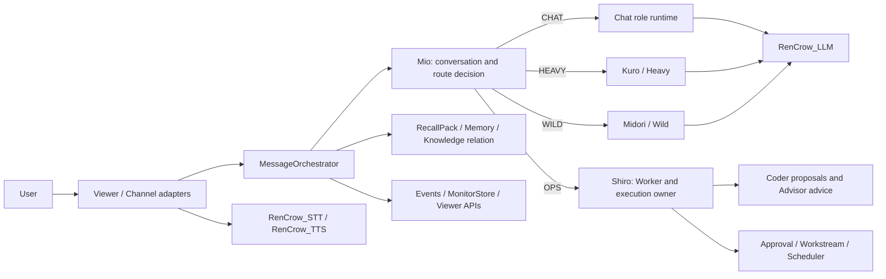
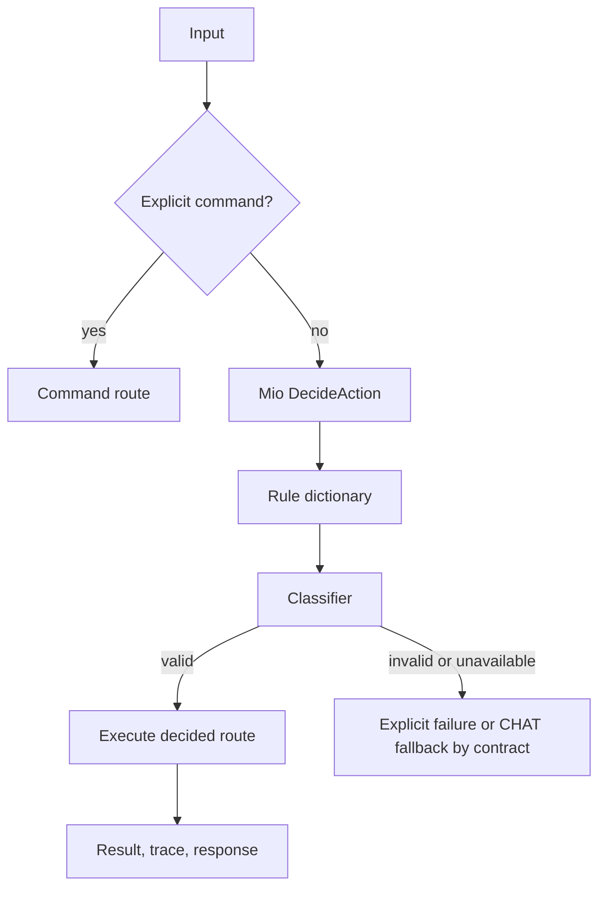
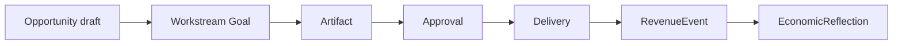

# 最新の全体仕様

## 概要

RenCrow CORE は、人格を持つ会話、作業実行、記憶・Recall、承認、継続作業、収益候補、安全境界、Viewer 観測を統合する orchestration runtime である。LLM・STT・TTS・Vision・ゲーム世界などの実行本体は別 module に置き、CORE は契約、ルーティング、状態、承認、監査、UI projection を所有する。

この章は「現在目指す全体」を表す。各項目の実装状態は [実装済み仕様](02_実装済み仕様.md) と [未実装仕様](03_未実装仕様.md) を参照する。

## 1. CORE の責務

CORE が所有するもの:

- LINE、Slack、Discord、Telegram、Viewer などからの入力統合
- Mio による通常 message の route decision と明示 command の優先処理
- Chat / Worker / Coder / Advisor / Tool の責務分離
- Persona、会話履歴、RecallPack、provenance、trace、role visibility
- side effect 前の approval gate、scope、TTL、監査ログ
- Workstream、Backlog、Scheduler、Heartbeat による継続作業
- Opportunity、EconomicTask、RevenueEvent、EconomicReflection の安全な管理
- Viewer REST/SSE、状態要約、degraded/error の明示
- 外部 module への接続契約、health、runtime selection の投影

CORE が所有しないもの:

- RenCrow_LLM の推論 server・モデル定義・物理 sampling 値
- RenCrow_STT / TTS / Vision の処理本体
- RenCrow_GAMES の世界、ActionIntent、Executor、Replay、Observer UI
- 横断再利用 tool、browser sidecar、data converter、validation CLI
- 外部情報を人間確認なしに確定知識へ昇格する処理

## 2. Agent、Advisor、Tool の責務

| 主体 | 現在の責務 |
| --- | --- |
| Mio | 通常 message の受領、`DecideAction`、会話、最終 user response |
| Shiro | Worker/OPS の実行責任、承認境界、Advisor の呼び出しと助言採否 |
| Coder1/2/3 | 設計・差分・提案。外部 side effect の最終 owner にはならない |
| Kuro / Heavy | 深い分析を必要とする chat route |
| Midori / Wild | 発想・創作・画像系を含む chat route |
| Advisor | Codex 等の外部専門家。助言を返すが実行責任を持たない |
| Tool | 明示された capability を実行する。人格・長期記憶・最終意思決定を持たない |

Viewer で `Mio` / `Shiro` / `Kuro` / `Midori` を選んだ場合も通常会話として扱う。内部では Shiro を ChatWorker、Kuro を Heavy、Midori を Wild に解決する。対象 runtime が利用不能なら Mio へ黙って fallback せず、選択対象のエラーを返す。

## 3. ルーティング契約

通常 message の route owner は Mio である。現在の基本順序は次の通り。

- 明示 command は Viewer の会話相手選択より優先する。
- Worker は決定済み route の実行、状態、結果、side effect を担う。
- reasoning や内部 route detail を user-facing 文面や TTS に混ぜない。
- trace、JobID、from/to、route、provenance は監査可能に残す。

## 4. State、Memory、Knowledge

- 会話履歴は発言ごとの `from` / `to` を保持し、Mio/Shiro/Kuro/Midori 間で共有する。
- RecallPack は L1、vector、DuckDB 等の検索結果を、budget、role visibility、provenance とともに組み立てる。
- Knowledge のカテゴリ別 storage は維持し、その上に Entity / Topic / Project を横断する relation layer を置く。
- relation expansion は制限付き 1-2 hop とし、reason を Recall trace に残す。
- 外部検索、Advisor 出力、Revenue 候補を自動で確定知識へ昇格しない。

## 5. Advisor と AgentProfile

- Codex 等は Agent や Tool ではなく Advisor として登録する。
- Shiro は `AdvisorService` を通じて助言を要求する。
- AdviceResult、run、policy decision、採用記録、score snapshot を監査可能に保存する。
- Advisor の能力、許可 artifact、risk、timeout、利用可否を policy で制御する。
- AgentProfile は人格、役割、capability、AutonomyEnvelope を定義し、Advisor policy と runtime 表示へ接続する。
- Advisor の score は run と採否・成果から定期更新できることを最終条件とする。

## 6. Workstream、Approval、Economic Objective

自律処理は draft-only から開始し、公開、外部送信、請求、契約、価格決定などは approval なしに実行しない。

- Opportunity は expected profit、risk、provenance を持つ。
- EconomicTask は task kind に応じて human approval の要否を判定する。
- Heartbeat の discovery は外部実行ではなく Opportunity draft の作成までに制限する。
- RevenueEvent は結果を表し、Reflection は outcome、lesson、next action を残す。
- 最終 To-Be は Opportunity から Workstream / Artifact / Approval / RevenueEvent / Reflection まで追跡可能に接続する。

## 7. Viewer と観測性

- REST API は操作・照会を、SSE と MonitorStore は timeline・状態更新を担う。
- Viewer は raw JSON を常時露出せず、最初に要約を表示し、長文 trace は details に閉じる。
- Advisor run/score/profile、Knowledge relation trace、Opportunity、approval queue、Reflection を観測できるようにする。
- unavailable、pending、degraded、error を成功表示へ丸めない。
- mobile 幅を含む responsive 表示を維持する。

## 8. Audio と外部 runtime

- CORE は STT/TTS の接続、リクエスト、状態、Viewer 操作を持つが、変換・合成本体は外部 module が所有する。
- 「表示文生成」「音声合成成功」「音声取得成功」「ブラウザ再生成功」は別状態として扱う。
- LLM の inference endpoint と management endpoint を分離する。
- runtime selection は ready 確認後に確定し、未設定・未起動を暗黙成功にしない。

## 9. モジュール構造

- `modules/*`: 外部利用可能な純粋 contract。依存を最小にする。
- `internal/features/*`: feature 単位の ownership、route registrar、background entry。
- `internal/domain/*`: domain type と validation。
- `internal/application/*`: use case と orchestration。
- `internal/adapter/*`: Viewer/channel/provider adapter。
- `internal/infrastructure/*`: persistence と外部技術実装。
- `cmd/rencrow`: composition root。移行期間中は legacy wiring も保持する。

非破壊移行を原則とし、legacy-body の挙動を維持したまま feature registrar へ ownership を移す。新しい公開 package は、複数 adapter で安定した契約だけを `modules/*` へ昇格する。

## 関連ドキュメント

- [実装済み仕様](02_実装済み仕様.md)
- [未実装仕様](03_未実装仕様.md)
- [古い仕様・不採用・要再確認](04_古い仕様・不採用・要再確認.md)
- `../../02_正本仕様/01_仕様.md`
- `../../02_正本仕様/02_実装仕様.md`
- `../../02_正本仕様/10_RenCrow_ToBe_統合仕様.md`
- `../../02_正本仕様/11_RenCrow_ToBe_統合実装仕様.md`
